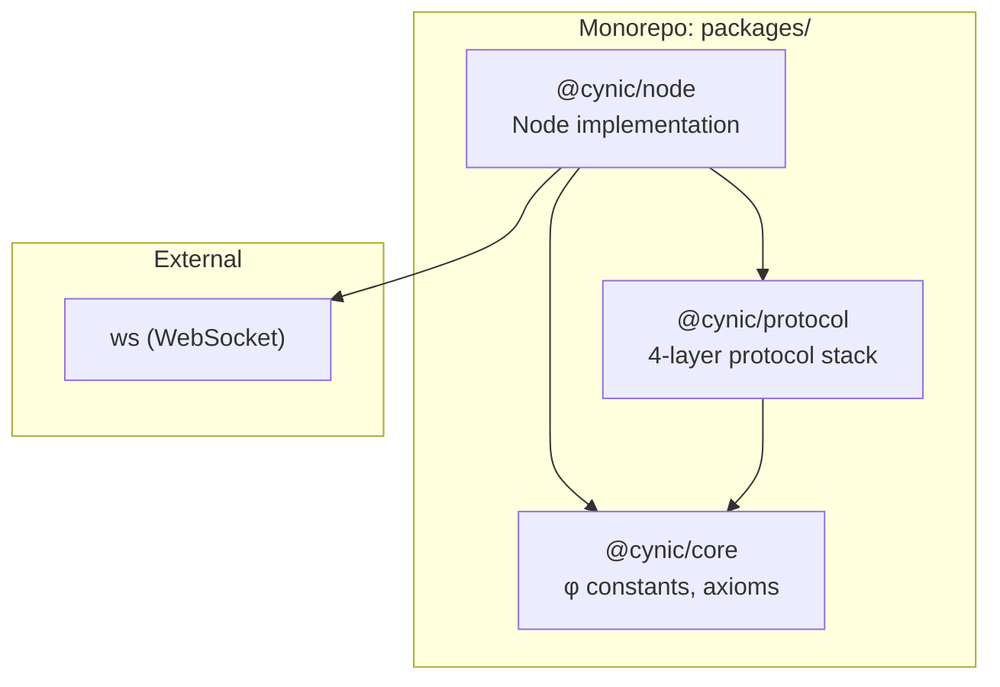
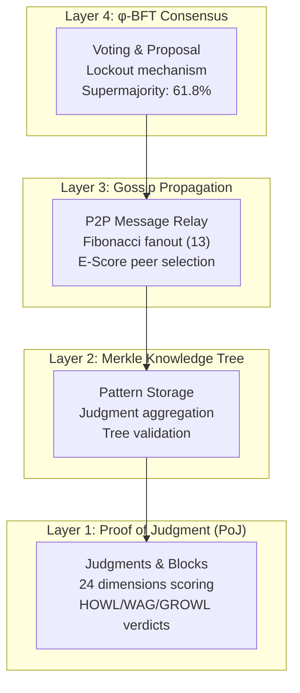
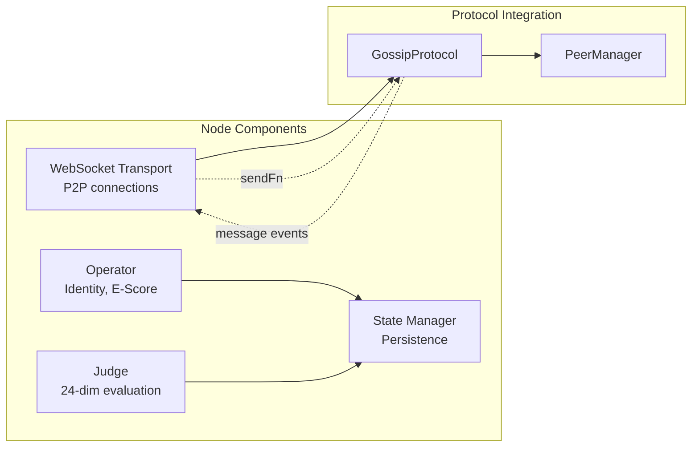
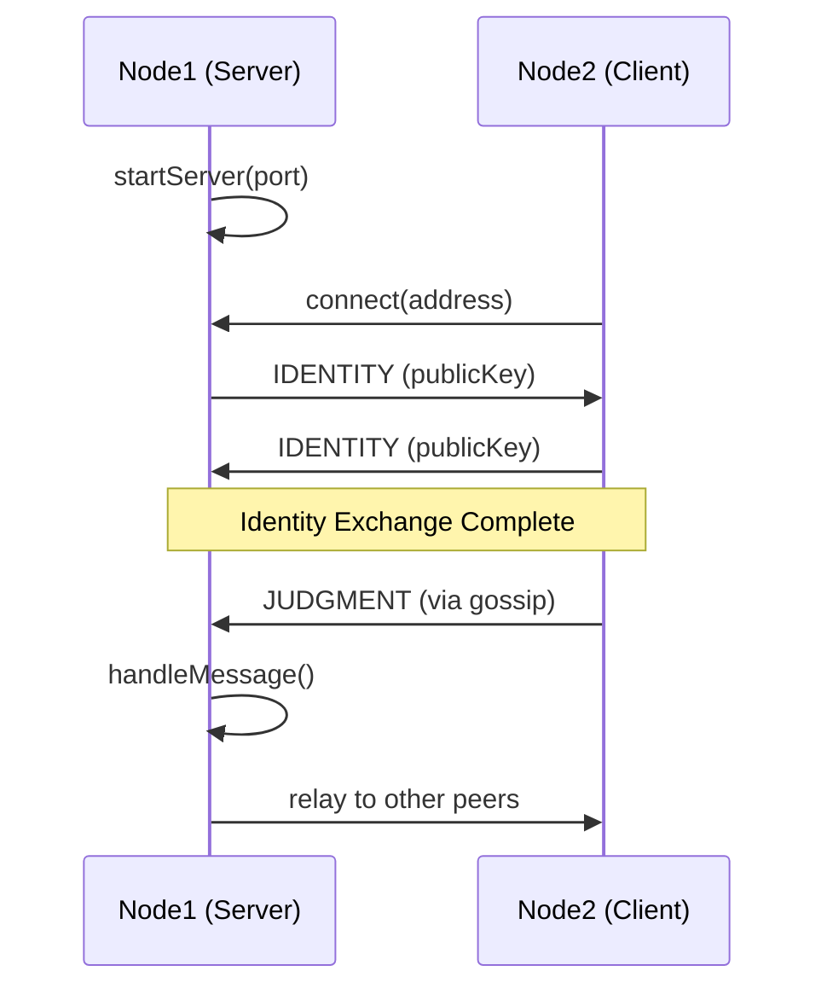

# CYNIC Architecture

> **Collective Your Node Into Consciousness**
> Decentralized judgment protocol with φ-aligned consensus

## System Overview

```
┌─────────────────────────────────────────────────────────────────┐
│                        CYNIC ECOSYSTEM                          │
├─────────────────────────────────────────────────────────────────┤
│                                                                 │
│  ┌─────────────┐    ┌─────────────┐    ┌─────────────┐         │
│  │   @cynic/   │    │   @cynic/   │    │   @cynic/   │         │
│  │    core     │◄───│  protocol   │◄───│    node     │         │
│  │             │    │             │    │             │         │
│  │ φ constants │    │ 4-layer     │    │ Operator    │         │
│  │ Axioms      │    │ protocol    │    │ Transport   │         │
│  └─────────────┘    └─────────────┘    └─────────────┘         │
│                                                                 │
└─────────────────────────────────────────────────────────────────┘
```

## Package Dependencies



## Protocol Stack (4 Layers)



## Node Architecture



## WebSocket Transport Flow



## φ (Phi) Alignment

The golden ratio φ = 1.618... guides all protocol parameters:

| Parameter | Value | Derivation |
|-----------|-------|------------|
| Max Confidence | 61.8% | φ⁻¹ |
| Supermajority | 61.8% | φ⁻¹ |
| Gossip Fanout | 13 | Fibonacci |
| Default Port | 8618 | 8 × φ × 1000 |
| Heartbeat | 61800ms | φ-aligned |

## Judgment Dimensions (24)

4 Axioms × 6 Dimensions each:

```
PHI (Golden Balance)     VERIFY (Truth Seeking)
├── context_awareness    ├── source_verification
├── balanced_analysis    ├── claim_accuracy
├── nuanced_response     ├── evidence_quality
├── appropriate_length   ├── logical_consistency
├── trade_off_handling   ├── bias_detection
└── integration          └── fact_checking

CULTURE (Collective)     BURN (Quality Control)
├── norm_compliance      ├── spam_detection
├── cultural_fit         ├── manipulation_detection
├── community_benefit    ├── toxicity_detection
├── stakeholder_aware    ├── quality_threshold
├── precedent_respect    ├── originality
└── inclusivity          └── value_contribution
```

## Directory Structure

```
CYNIC-new/
├── packages/
│   ├── core/           # Constants, axioms (PHI, PHI_INV, etc.)
│   │   └── src/
│   │       └── axioms/
│   │
│   ├── protocol/       # 4-layer protocol implementation
│   │   ├── src/
│   │   │   ├── poj/        # Layer 1: Proof of Judgment
│   │   │   ├── merkle/     # Layer 2: Knowledge Tree
│   │   │   ├── gossip/     # Layer 3: Propagation
│   │   │   ├── consensus/  # Layer 4: φ-BFT
│   │   │   └── crypto/     # Signatures, hashing
│   │   └── test/
│   │
│   └── node/           # Node implementation
│       ├── src/
│       │   ├── operator/   # Identity, E-Score
│       │   ├── state/      # Persistence
│       │   └── transport/  # WebSocket P2P (NEW)
│       ├── test/
│       └── examples/       # P2P demo scripts
│
└── docs/               # Documentation
```

## Current Branch: `main`

All work is on `main`. No feature branches created yet.

## Test Status

| Package | Tests | Status |
|---------|-------|--------|
| @cynic/protocol | 151 | ✅ Pass |
| @cynic/node | 111 | ✅ Pass |

## Getting Started (New Developer)

```bash
# Install dependencies
npm install

# Run all tests
npm test

# Test P2P network
node packages/node/examples/two-nodes-test.js

# Interactive gossip demo (2 terminals)
# Terminal 1:
node packages/node/examples/gossip-network.js server 8618
# Terminal 2:
node packages/node/examples/gossip-network.js client ws://localhost:8618
```

## Recent Work (Uncommitted)

1. **Transport Layer** (`packages/node/src/transport/`)
   - WebSocket server/client
   - Auto-reconnect with φ exponential backoff
   - Identity exchange protocol
   - Message serialization with checksum

2. **Test Suites** (`packages/*/test/`)
   - Protocol tests (151)
   - Node tests (111)

3. **Bug Fixes**
   - Inbound connection identity handling
   - Peer ID remapping after identity exchange
   - Duplicate connection detection
