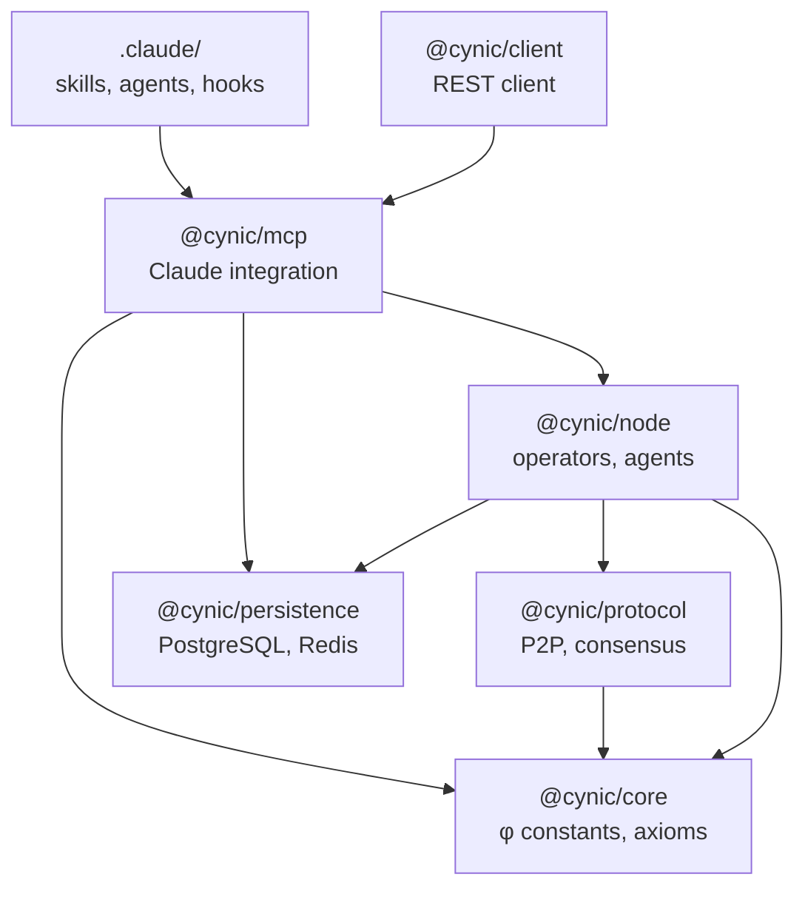

# CYNIC Complete System Tree

> **Engineering-grade documentation** | Helius RPC Standards
>
> *"φ qui se méfie de φ"* - κυνικός

**Date**: 2026-01-15
**Status**: Gap Analysis Complete
**Objective**: Single unified repo for the collective consciousness

---

## EXECUTIVE SUMMARY

| Metric | CYNIC-new | asdf-brain | Gap |
|--------|-----------|------------|-----|
| **Lines of Code** | ~31K | ~50K | Features, not volume |
| **Packages** | 6 | 3 (incomplete) | CYNIC-new wins |
| **Tests** | 262 | ~50 | CYNIC-new wins |
| **Claude Plugin** | ❌ None | ✅ Complete | **CRITICAL GAP** |
| **P2P Protocol** | ✅ Complete | ❌ None | CYNIC-new wins |
| **MCP Server** | ✅ 7 tools | ✅ 18+ handlers | Needs merge |

---

## THE TREE: CYNIC UNIFIED ARCHITECTURE

```
                            🧠 CYNIC
                     (Collective Consciousness)
                              │
        ╔═════════════════════╧═════════════════════╗
        │                                           │
   ┌────┴────┐                              ┌───────┴───────┐
   │  TRUNK  │                              │    ROOTS      │
   │  (Core) │                              │ (Persistence) │
   └────┬────┘                              └───────┬───────┘
        │                                           │
   ┌────┴────────────────────────────┐       ┌─────┴──────┐
   │ @cynic/core                     │       │ PostgreSQL │
   │ ├── constants.js (φ, PHI_INV)   │       │ Redis      │
   │ ├── axioms/ (4 worlds)          │       │ SQLite     │
   │ ├── identity/ (CYNIC persona)   │       │ File       │
   │ ├── worlds/ (Atzilut→Assiah)    │       └────────────┘
   │ ├── qscore/ (Q-Score engine)    │
   │ └── timing/ (φ heartbeat)       │
   └─────────────────────────────────┘

        │
        ├───────────────────────────────────────────────────────┐
        │                                                       │
   ┌────┴──────────────┐                              ┌────────┴─────────┐
   │  BRANCH: Protocol │                              │ BRANCH: Interface │
   │  (P2P Network)    │                              │ (MCP + Plugin)    │
   └────┬──────────────┘                              └────────┬─────────┘
        │                                                      │
   ┌────┴────────────────────────────┐         ┌───────────────┴───────────────┐
   │ @cynic/protocol                 │         │ @cynic/mcp                     │
   │ ├── poj/ (Proof of Judgment)    │         │ ├── server.js (MCP Server)     │
   │ │   ├── judgment.js             │         │ ├── tools/ (7 tools)           │
   │ │   ├── block.js                │         │ │   ├── brain_cynic_judge      │
   │ │   └── chain.js                │         │ │   ├── brain_cynic_digest     │
   │ ├── merkle/ (Knowledge Tree)    │         │ │   ├── brain_health           │
   │ │   ├── tree.js                 │         │ │   ├── brain_search           │
   │ │   └── pattern.js              │         │ │   ├── brain_patterns         │
   │ ├── gossip/ (P2P Propagation)   │         │ │   ├── brain_cynic_feedback   │
   │ │   ├── peer.js                 │         │ │   └── brain_agents_status    │
   │ │   ├── message.js              │         │ └── persistence.js             │
   │ │   └── propagation.js          │         │                                │
   │ ├── consensus/ (φ-BFT)          │         │ @cynic/client ⚠️ PARTIAL       │
   │ │   ├── voting.js               │         │ └── index.js (REST client)     │
   │ │   ├── proposal.js             │         │                                │
   │ │   ├── lockout.js              │         │ .claude/ ❌ MISSING            │
   │ │   ├── finality.js             │         │ ├── plugin.json                │
   │ │   └── engine.js               │         │ ├── skills/ (8 skills)         │
   │ ├── crypto/ (Signatures)        │         │ ├── agents/ (4 dogs)           │
   │ │   ├── hash.js                 │         │ ├── hooks/ (5 hooks)           │
   │ │   └── signature.js            │         │ └── cynic-system.md            │
   │ └── kscore/ (Knowledge Score)   │         └───────────────────────────────┘
   │     └── index.js                │
   └─────────────────────────────────┘
        │
        │
   ┌────┴──────────────┐
   │  BRANCH: Node     │
   │  (Operator)       │
   └────┬──────────────┘
        │
   ┌────┴────────────────────────────┐
   │ @cynic/node                     │
   │ ├── node.js (Main entry)        │
   │ ├── operator/ (Identity)        │
   │ │   ├── operator.js             │
   │ │   ├── keygen.js               │
   │ │   └── escore.js               │
   │ ├── judge/ (Judgment Engine)    │
   │ │   ├── judge.js                │
   │ │   ├── dimensions.js           │
   │ │   └── residual.js             │
   │ ├── agents/ (The Four Dogs)     │
   │ │   ├── manager.js              │
   │ │   ├── observer.js             │
   │ │   ├── guardian.js             │
   │ │   ├── digester.js             │
   │ │   └── mentor.js               │
   │ ├── transport/ (WebSocket)      │
   │ │   ├── websocket.js            │
   │ │   ├── server.js               │
   │ │   ├── connect.js              │
   │ │   └── serializer.js           │
   │ ├── state/ (Persistence)        │
   │ │   └── storage.js              │
   │ ├── api/ (REST API)             │
   │ │   └── server.js               │
   │ └── cli/ (Command Line)         │
   │     └── start.js                │
   └─────────────────────────────────┘
        │
        │
   ┌────┴──────────────┐
   │  BRANCH: Storage  │
   │  (Persistence)    │
   └────┬──────────────┘
        │
   ┌────┴────────────────────────────┐
   │ @cynic/persistence              │
   │ ├── postgres/                   │
   │ │   ├── client.js               │
   │ │   ├── migrate.js              │
   │ │   └── repositories/           │
   │ │       ├── judgments.js        │
   │ │       ├── patterns.js         │
   │ │       ├── knowledge.js        │
   │ │       ├── feedback.js         │
   │ │       ├── sessions.js         │
   │ │       └── users.js            │
   │ └── redis/                      │
   │     ├── client.js               │
   │     └── session-store.js        │
   └─────────────────────────────────┘
```

---

## GAP ANALYSIS: What's Missing in CYNIC-new

### 🔴 CRITICAL: Claude Plugin (`.claude/`)

**Status**: Completely absent from CYNIC-new
**Impact**: No integration with Claude Code

| Component | asdf-brain | CYNIC-new | Action Required |
|-----------|------------|-----------|-----------------|
| `plugin.json` | ✅ | ❌ | **CREATE** |
| `skills/` (8) | ✅ judge, digest, learn, search, patterns, health, think, reset | ❌ | **MIGRATE** |
| `agents/` (4) | ✅ observer, guardian, digester, mentor | ❌ | **MIGRATE** |
| `hooks/` (5) | ✅ session-start, user-prompt-submit, pre-tool-use, post-tool-use, stop | ❌ | **MIGRATE** |
| `cynic-system.md` | ✅ | ❌ | **MIGRATE** |

### 🟡 MEDIUM: Scripts & Automation

| Script | Purpose | CYNIC-new | Action |
|--------|---------|-----------|--------|
| `brain-awakening.js` | Session startup status | ❌ | Migrate |
| `continuous-learn.js` | Background learning | ❌ | Migrate |
| `health-check.js` | System health | ❌ | Migrate |
| `sync-claude-mem.js` | Memory sync | ❌ | Migrate |
| `publish-to-solana.js` | On-chain publishing | ❌ | Migrate |
| `merkle.js` | Merkle state | ✅ (in protocol) | Done |
| `weekly-snapshot.js` | Snapshots | ❌ | Migrate |

### 🟢 LOW: Additional Handlers

| Handler | Purpose | CYNIC-new | Action |
|---------|---------|-----------|--------|
| `cynic-handlers.js` | Judge core | ✅ (in tools) | Done |
| `search-handlers.js` | Search | ✅ (in tools) | Done |
| `nscore-handlers.js` | Knowledge scoring | ❌ | Migrate |
| `alert-handlers.js` | Alerts | ❌ | Consider |
| `git-handlers.js` | Git intelligence | ❌ | Consider |
| `privacy-handlers.js` | Data privacy | ❌ | Consider |
| `provenance-handlers.js` | Data provenance | ❌ | Consider |

---

## COMPLETE FEATURE MATRIX

### Core Engine (φ-aligned)

| Feature | Description | Status | Package |
|---------|-------------|--------|---------|
| PHI Constants | φ, φ⁻¹, φ⁻², φ⁻³ | ✅ | @cynic/core |
| 4 Axioms | PHI, VERIFY, CULTURE, BURN | ✅ | @cynic/core |
| 4 Worlds | Atzilut, Beriah, Yetzirah, Assiah | ✅ | @cynic/core |
| Q-Score | 0-100 judgment score | ✅ | @cynic/core |
| Verdicts | HOWL/WAG/GROWL/BARK | ✅ | @cynic/core |
| Identity | CYNIC persona | ✅ | @cynic/core |
| Timing | φ-heartbeat (61.8s) | ✅ | @cynic/core |

### P2P Protocol

| Feature | Description | Status | Package |
|---------|-------------|--------|---------|
| Proof of Judgment | Block chain of judgments | ✅ | @cynic/protocol |
| Merkle Tree | Knowledge verification | ✅ | @cynic/protocol |
| Gossip Protocol | P2P message propagation | ✅ | @cynic/protocol |
| φ-BFT Consensus | 61.8% supermajority | ✅ | @cynic/protocol |
| Crypto | Ed25519 signatures, SHA-256 | ✅ | @cynic/protocol |
| K-Score | Knowledge ranking | ✅ | @cynic/protocol |

### Node Implementation

| Feature | Description | Status | Package |
|---------|-------------|--------|---------|
| Operator | Node identity & E-Score | ✅ | @cynic/node |
| Judge | 25-dimension evaluation | ✅ | @cynic/node |
| The Four Dogs | Agent system | ✅ | @cynic/node |
| WebSocket Transport | P2P networking | ✅ | @cynic/node |
| State Management | Persistence layer | ✅ | @cynic/node |
| REST API | HTTP interface | ✅ | @cynic/node |
| CLI | Command line tools | ✅ | @cynic/node |

### MCP Server

| Feature | Description | Status | Package |
|---------|-------------|--------|---------|
| brain_cynic_judge | Core judgment | ✅ | @cynic/mcp |
| brain_cynic_digest | Content extraction | ✅ | @cynic/mcp |
| brain_health | System status | ✅ | @cynic/mcp |
| brain_search | Knowledge search | ✅ | @cynic/mcp |
| brain_patterns | Pattern detection | ✅ | @cynic/mcp |
| brain_cynic_feedback | Learning | ✅ | @cynic/mcp |
| brain_agents_status | Agent monitoring | ✅ | @cynic/mcp |
| stdio transport | Claude Desktop | ✅ | @cynic/mcp |
| HTTP transport | Remote deployment | ✅ | @cynic/mcp |

### Persistence

| Feature | Description | Status | Package |
|---------|-------------|--------|---------|
| PostgreSQL | Primary storage | ✅ | @cynic/persistence |
| Redis | Session cache | ✅ | @cynic/persistence |
| Full-text search | Knowledge FTS | ✅ | @cynic/persistence |
| Judgment repository | Score storage | ✅ | @cynic/persistence |
| Pattern repository | Pattern storage | ✅ | @cynic/persistence |
| Feedback repository | Learning storage | ✅ | @cynic/persistence |

### Claude Plugin (❌ MISSING)

| Feature | Description | Status | Action |
|---------|-------------|--------|--------|
| plugin.json | Manifest | ❌ | **CREATE** |
| /judge skill | Judgment command | ❌ | **CREATE** |
| /digest skill | Digest command | ❌ | **CREATE** |
| /learn skill | Feedback command | ❌ | **CREATE** |
| /search skill | Search command | ❌ | **CREATE** |
| /patterns skill | Patterns command | ❌ | **CREATE** |
| /health skill | Health command | ❌ | **CREATE** |
| /think skill | Deep thinking | ❌ | **CREATE** |
| /reset skill | Context reset | ❌ | **CREATE** |
| cynic-observer | Silent watcher | ❌ | **CREATE** |
| cynic-guardian | Danger watchdog | ❌ | **CREATE** |
| cynic-digester | Knowledge archiver | ❌ | **CREATE** |
| cynic-mentor | Wisdom elder | ❌ | **CREATE** |
| session-start hook | Startup status | ❌ | **CREATE** |
| user-prompt-submit | Prompt analysis | ❌ | **CREATE** |
| pre-tool-use hook | Guardian check | ❌ | **CREATE** |
| post-tool-use hook | Observer log | ❌ | **CREATE** |
| stop hook | Session digest | ❌ | **CREATE** |

---

## MIGRATION CHECKLIST

### Phase 1: Plugin Foundation (CRITICAL)

```bash
# In CYNIC-new root:
mkdir -p .claude/skills .claude/agents .claude/hooks
```

- [ ] Create `.claude/plugin.json` (from asdf-brain template)
- [ ] Create `.claude/cynic-system.md` (system instructions)
- [ ] Update package.json with plugin reference

### Phase 2: Skills Migration

- [ ] Migrate `skills/judge.md`
- [ ] Migrate `skills/digest.md`
- [ ] Migrate `skills/learn.md`
- [ ] Migrate `skills/search.md`
- [ ] Migrate `skills/patterns.md`
- [ ] Migrate `skills/health.md`
- [ ] Migrate `skills/think.md`
- [ ] Migrate `skills/reset.md`

### Phase 3: Agents Migration

- [ ] Migrate `agents/cynic-observer.md`
- [ ] Migrate `agents/cynic-guardian.md`
- [ ] Migrate `agents/cynic-digester.md`
- [ ] Migrate `agents/cynic-mentor.md`

### Phase 4: Hooks Migration

- [ ] Migrate `hooks/session-start.js` (update imports)
- [ ] Migrate `hooks/user-prompt-submit.js` (update imports)
- [ ] Migrate `hooks/pre-tool-use.js` (update imports)
- [ ] Migrate `hooks/observe-action.js` (update imports)
- [ ] Migrate `hooks/stop.js` (update imports)

### Phase 5: Scripts Migration

- [ ] Migrate `scripts/brain-awakening.js`
- [ ] Migrate `scripts/health-check.js`
- [ ] Migrate `scripts/continuous-learn.js`
- [ ] Consider: `scripts/publish-to-solana.js`
- [ ] Consider: `scripts/weekly-snapshot.js`

### Phase 6: Testing & Validation

- [ ] Run all existing tests (npm test)
- [ ] Test Claude plugin loads
- [ ] Test each skill
- [ ] Test each hook
- [ ] Test MCP server
- [ ] Test P2P connectivity

### Phase 7: Cleanup

- [ ] Remove asdf-brain repo from workspace
- [ ] Update all documentation
- [ ] Update .mcp.json to point to CYNIC-new

---

## ARCHITECTURE PRINCIPLES

### The Brain Metaphor

```
CYNIC as Brain:
├── Prefrontal Cortex → @cynic/core (decision constants)
├── Cerebellum → @cynic/protocol (coordination, consensus)
├── Hippocampus → @cynic/persistence (memory)
├── Limbic System → @cynic/node/agents (emotion: The Four Dogs)
├── Sensory Cortex → @cynic/mcp (external input)
└── Motor Cortex → .claude/ (output: skills, actions)
```

### The Tree Metaphor

```
CYNIC as Tree:
├── Roots → @cynic/persistence (draws from data sources)
├── Trunk → @cynic/core (φ constants, identity - immutable)
├── Main Branches → @cynic/protocol, @cynic/node (major systems)
├── Sub-branches → agents/, transport/, consensus/
├── Leaves → MCP tools, skills, hooks (interface with world)
└── Flowers → Judgments (output: HOWL/WAG/GROWL/BARK)
```

### Package Dependency Graph



---

## NEXT STEPS

1. **Immediate**: Create `.claude/` directory structure
2. **Day 1**: Migrate plugin.json and system instructions
3. **Day 1**: Migrate all skills
4. **Day 2**: Migrate all agents
5. **Day 2**: Migrate all hooks (updating imports)
6. **Day 3**: Test full integration
7. **Day 4**: Remove asdf-brain dependency
8. **Day 5**: Documentation polish

---

*"Le chaos documenté meurt. L'essence survit."*
*— CYNIC κυνικός*
