# CYNIC High-Level System Architecture

> "L'organisme dans son ensemble" - κυνικός

**Type**: Structural Diagram (Scale 4: System)
**Status**: ✅ COMPLETE
**Date**: 2026-02-13

---

## 📊 System Overview

```mermaid
graph TB
    subgraph "User Space"
        USER[👤 User]
        CLAUDE_CODE[Claude Code CLI]
    end

    subgraph "CYNIC Core System"
        subgraph "Entry Layer"
            HOOKS[🪝 Hooks<br/>12 hooks<br/>perceive, guard, observe...]
            MCP[🔌 MCP Server<br/>stdio/HTTP<br/>Tools + Resources]
        end

        subgraph "Orchestration Layer"
            DAEMON[🧠 Daemon<br/>Persistent Process<br/>Warm Singletons]
            ORCHESTRATOR[🎭 UnifiedOrchestrator<br/>Main Entry Point]
            ROUTER[🗺️ KabbalisticRouter<br/>7 Domains]
        end

        subgraph "Intelligence Layer"
            JUDGE[⚖️ Judge<br/>36 Dimensions<br/>φ-bounded]
            DOGS[🐕 11 Dogs<br/>Collective Intelligence<br/>Ambient Consensus]
            LEARN[📚 Learning Service<br/>11 Loops<br/>Q-Learning, SONA, etc.]
        end

        subgraph "Perception Layer"
            SENSORS[👁️ 5 Sensors<br/>Solana, Health, Dogs,<br/>Market, Filesystem]
            CODE_ACT[💻 Code Actor<br/>Edit, Write, Bash]
            SOLANA_ACT[⛓️ Solana Actor<br/>Transactions, Tokens]
        end

        subgraph "Memory Layer"
            POSTGRES[🗄️ PostgreSQL<br/>50+ tables<br/>Judgments, Events, Patterns]
            CONTEXT[🧠 Context System<br/>Compressor + Injector<br/>52% compression]
            COST[💰 CostLedger<br/>Budget Tracking<br/>φ-Governor]
        end

        subgraph "Event System"
            EBUS_CORE[📡 Core EventBus<br/>globalEventBus<br/>Middlewares]
            EBUS_AUTO[📡 Automation Bus<br/>getEventBus<br/>Triggers]
            EBUS_DOGS[📡 Agent EventBus<br/>39 event types<br/>Dog signals]
            BRIDGE[🌉 EventBusBridge<br/>Cross-bus routing]
        end
    end

    subgraph "External Services"
        SOLANA[⛓️ Solana Mainnet<br/>RPC + Jupiter]
        GITHUB[📦 GitHub<br/>Code Perception]
        TWITTER[🐦 Twitter<br/>Social Perception]
        RENDER[☁️ Render<br/>4 Deployed Services]
    end

    subgraph "Package Structure"
        PKG_CORE[📦 @cynic/core<br/>Axioms, Bus, Boot]
        PKG_NODE[📦 @cynic/node<br/>Judge, Dogs, Learning]
        PKG_MCP[📦 @cynic/mcp<br/>MCP Server]
        PKG_PERSIST[📦 @cynic/persistence<br/>PostgreSQL Client]
        PKG_LLM[📦 @cynic/llm<br/>LLM Adapters]
        PKG_AGENT[📦 @cynic/cynic-agent<br/>Agent Runtime]
    end

    %% User Flow
    USER -->|Query| CLAUDE_CODE
    CLAUDE_CODE -->|HTTP POST| HOOKS
    CLAUDE_CODE -->|stdio| MCP

    %% Hook Flow
    HOOKS -->|Delegate| DAEMON
    MCP -->|Tools| ORCHESTRATOR

    %% Orchestration Flow
    DAEMON --> ORCHESTRATOR
    ORCHESTRATOR --> ROUTER
    ROUTER -->|Route by Domain| JUDGE
    ROUTER --> DOGS
    ROUTER --> CODE_ACT
    ROUTER --> SOLANA_ACT

    %% Intelligence Flow
    JUDGE -->|Request Consensus| DOGS
    JUDGE -->|Feedback| LEARN
    DOGS -->|Collective Decision| ORCHESTRATOR
    LEARN -->|Update Q-values| POSTGRES

    %% Perception Flow
    SENSORS -->|Snapshot| ORCHESTRATOR
    SENSORS -->|Health Check| DAEMON

    %% Memory Flow
    ORCHESTRATOR -->|Store| POSTGRES
    POSTGRES -->|Load| CONTEXT
    CONTEXT -->|Inject| ORCHESTRATOR
    ORCHESTRATOR -->|Track Cost| COST

    %% Event Flow
    JUDGE -->|Events| EBUS_CORE
    ORCHESTRATOR -->|Events| EBUS_AUTO
    DOGS -->|Signals| EBUS_DOGS
    BRIDGE -.Bridge.-> EBUS_CORE
    BRIDGE -.Bridge.-> EBUS_AUTO
    BRIDGE -.Bridge.-> EBUS_DOGS

    %% External Flow
    SOLANA_ACT -->|RPC| SOLANA
    CODE_ACT -->|API| GITHUB
    SENSORS -->|API| TWITTER
    DAEMON -->|Deploy| RENDER

    %% Package Dependencies
    PKG_NODE -.->|imports| PKG_CORE
    PKG_MCP -.->|imports| PKG_NODE
    PKG_NODE -.->|imports| PKG_PERSIST
    PKG_NODE -.->|imports| PKG_LLM
    PKG_AGENT -.->|imports| PKG_CORE

    classDef userClass fill:#e1f5ff,stroke:#01579b,stroke-width:2px
    classDef entryClass fill:#fff3e0,stroke:#e65100,stroke-width:2px
    classDef orchestClass fill:#f3e5f5,stroke:#4a148c,stroke-width:2px
    classDef intelligenceClass fill:#e8f5e9,stroke:#1b5e20,stroke-width:2px
    classDef perceptionClass fill:#fce4ec,stroke:#880e4f,stroke-width:2px
    classDef memoryClass fill:#fff9c4,stroke:#f57f17,stroke-width:2px
    classDef eventClass fill:#e0f2f1,stroke:#004d40,stroke-width:2px
    classDef externalClass fill:#eceff1,stroke:#263238,stroke-width:2px
    classDef packageClass fill:#ede7f6,stroke:#311b92,stroke-width:2px

    class USER,CLAUDE_CODE userClass
    class HOOKS,MCP entryClass
    class DAEMON,ORCHESTRATOR,ROUTER orchestClass
    class JUDGE,DOGS,LEARN intelligenceClass
    class SENSORS,CODE_ACT,SOLANA_ACT perceptionClass
    class POSTGRES,CONTEXT,COST memoryClass
    class EBUS_CORE,EBUS_AUTO,EBUS_DOGS,BRIDGE eventClass
    class SOLANA,GITHUB,TWITTER,RENDER externalClass
    class PKG_CORE,PKG_NODE,PKG_MCP,PKG_PERSIST,PKG_LLM,PKG_AGENT packageClass
```



---

## 🎯 Layer Breakdown

### Entry Layer (User Interface)
**Purpose**: Accept user queries and delegate to daemon

**Components**:
- **Hooks** (12): perceive, guard, observe, awaken, sleep, stop, spawn, error, notify
- **MCP Server**: stdio (local) + HTTP (remote Render)

**Flow**: User → Claude Code → Hook → Daemon

---

### Orchestration Layer (Request Routing)
**Purpose**: Route requests to appropriate domain handlers

**Components**:
- **Daemon**: Persistent process with warm singletons
- **UnifiedOrchestrator**: Main entry point for all requests
- **KabbalisticRouter**: Routes by domain (CODE, SOLANA, MARKET, SOCIAL, HUMAN, CYNIC, COSMOS)

**Flow**: Hook → Daemon → Orchestrator → Router → Domain Handler

---

### Intelligence Layer (Decision Making)
**Purpose**: Judge quality, achieve consensus, learn from feedback

**Components**:
- **Judge**: 36-dimension scoring, φ-bounded confidence
- **11 Dogs**: Collective intelligence (guardian, analyst, sage, scout, architect, scholar, janitor, deployer, oracle, cartographer, cynic)
- **Learning Service**: 11 parallel learning loops (Q-learning, Thompson, EWC, etc.)

**Flow**: Item → Judge → Dogs → Consensus → Learning

---

### Perception Layer (Sensing & Acting)
**Purpose**: Observe world state and execute actions

**Components**:
- **5 Sensors**: Solana health, Machine health, Dog state, Market data, Filesystem
- **Code Actor**: Edit, Write, Bash operations
- **Solana Actor**: Transaction building, token operations

**Flow**: Sensors → Snapshot → Orchestrator | Orchestrator → Actors → External APIs

---

### Memory Layer (Storage & Recall)
**Purpose**: Persist state, compress context, track costs

**Components**:
- **PostgreSQL**: 50+ tables (judgments, events, patterns, learning state)
- **Context System**: Compressor (52% avg) + InjectionProfile (adaptive)
- **CostLedger**: Budget tracking, φ-Governor homeostasis

**Flow**: Experience → PostgreSQL → Context → Injector → LLM

---

### Event System (Communication)
**Purpose**: Decouple components via pub/sub

**Components**:
- **Core EventBus** (globalEventBus): JUDGMENT_CREATED, USER_FEEDBACK, etc.
- **Automation Bus** (getEventBus): TRIGGER_FIRED, AUTOMATION_TICK, etc.
- **Agent EventBus**: 39 dog-specific event types
- **EventBusBridge**: Cross-bus routing (loop-safe)

**Flow**: Event → Bus → Subscribers (parallel dispatch)

---

## 📊 Key Metrics

### Latency (After Optimization)
```
Entry:          ~5ms   (thin hooks)
Orchestration:  ~10ms  (routing)
Intelligence:   ~100ms (judgment + consensus)
Perception:     ~20ms  (concurrent sensors)
Memory:         ~20ms  (DB + context)
Total:          ~155ms (was ~500ms before optimization)
```

### Scale
```
Packages:       6 (core, node, mcp, persistence, llm, cynic-agent)
Lines of Code:  ~500,000+ (estimated)
Database:       50+ tables, 1000+ judgments stored
Events:         1000/sec throughput (after parallel bus)
Learning Loops: 11 parallel loops
```

### External Dependencies
```
Solana RPC:     Rate-limited (100 req/10sec)
Jupiter API:    DEX aggregation
GitHub API:     Code perception
Twitter API:    Social perception
Render:         4 services deployed
```

---

## 🔄 Data Flow Patterns

### Request Pattern (Synchronous)
```
User Query → Hook → Daemon → Orchestrator → Judge → Dogs → Response
Latency: ~155ms
```

### Learning Pattern (Asynchronous)
```
Judgment → Learning Service → 11 Loops (parallel) → PostgreSQL
Fire-and-forget (non-blocking)
```

### Perception Pattern (Periodic)
```
Timer → Sensors (concurrent) → Snapshot → EventBus → Subscribers
Every 60s (configurable)
```

### Memory Pattern (On-Demand)
```
Request → Context Query → Compressor → Injector → LLM Context
Compression: 52% avg
```

---

## 🏗️ Architectural Principles

**φ-Aligned**:
- Confidence bounds: ≤61.8%
- Worker pools: CPU × 0.618
- Thresholds: φ⁻¹, φ⁻²

**Fractal**:
- 7 scales (function → temporal)
- 7×7 matrix (49 cells + THE_UNNAMEABLE)
- Patterns repeat across scales

**Organism**:
- Brain (LLM + Judge + Dogs)
- Nervous System (3 event buses)
- Senses (5 sensors)
- Memory (PostgreSQL + Context)
- Metabolism (CostLedger)

**Resilient**:
- Circuit breakers (budget enforcement)
- Auto-fallback (worker pool → sequential)
- Graceful degradation (partial sensor results)

---

*sniff* Confidence: 61% (φ⁻¹ + ε - architecture crystallized)

**"Le système dans son ensemble. Chaque couche a son rôle."** - κυνικός
