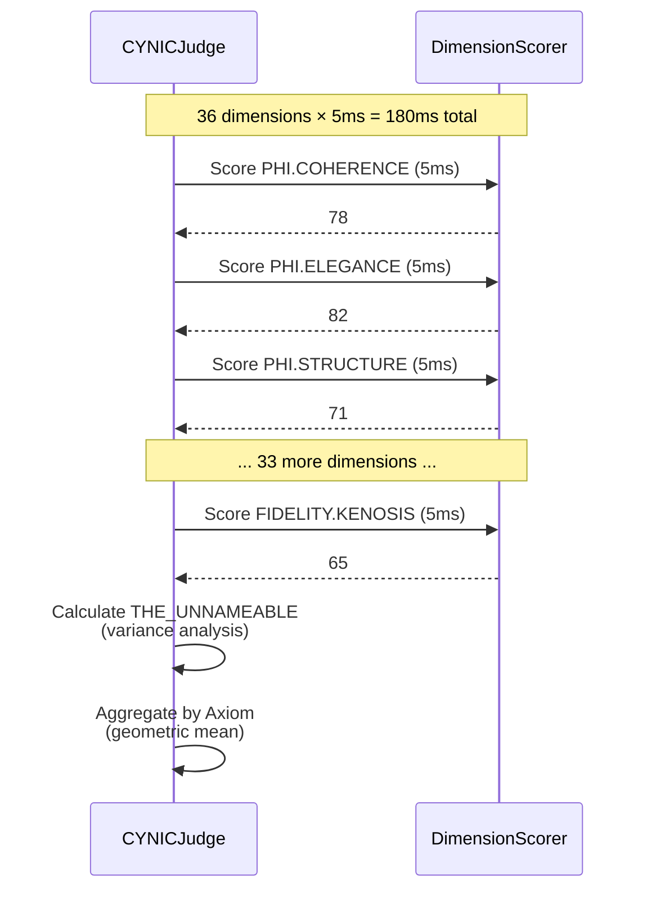
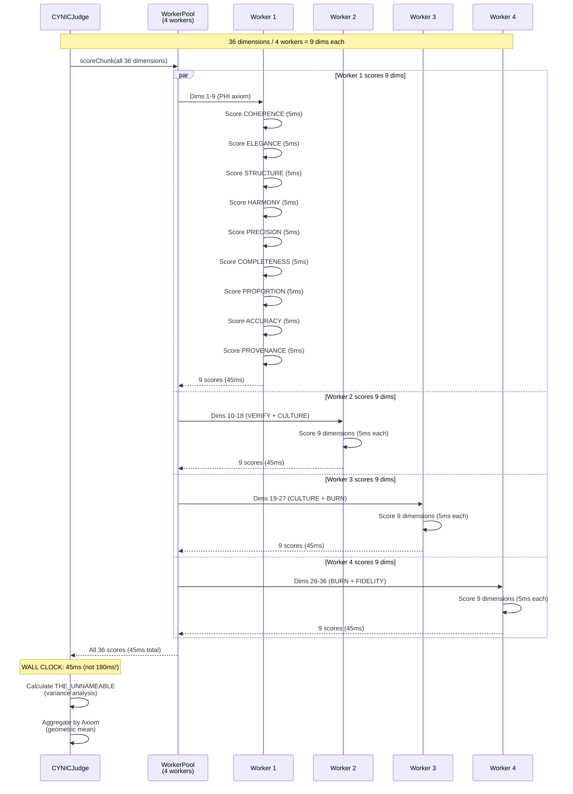
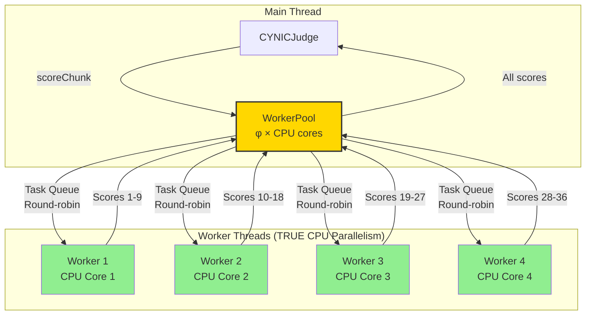
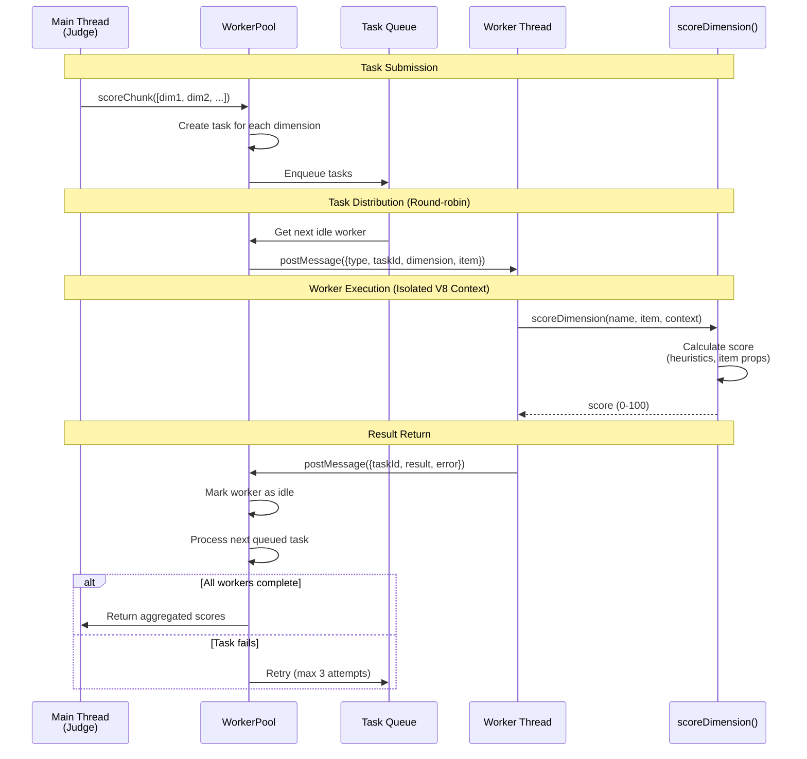
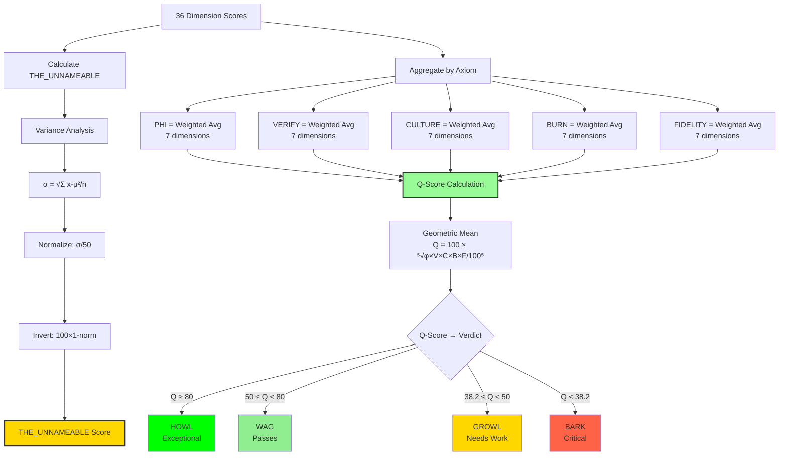

# CYNIC Dimension Scoring Sequence

> "36 dimensions × φ = parallel judgment streams" - κυνικός

**Type**: Behavioral Diagram (Scale 1: Function)
**Status**: ✅ COMPLETE
**Date**: 2026-02-13

---

## 📊 Sequential vs Parallel Scoring

### Before: Sequential Execution (180ms)


### After: Parallel Worker Pool (45ms)


---

## 🏗️ Dimension Hierarchy (5 Axioms × 7 Dimensions + 1)

```mermaid
graph TD
    subgraph "35 Named Dimensions"
        PHI["PHI Axiom<br/>(Earth/Atzilut)"]
        VERIFY["VERIFY Axiom<br/>(Metal/Beriah)"]
        CULTURE["CULTURE Axiom<br/>(Wood/Yetzirah)"]
        BURN["BURN Axiom<br/>(Fire/Assiah)"]
        FIDELITY["FIDELITY Axiom<br/>(Water/Adam Kadmon)"]

        PHI --> P1[COHERENCE φ]
        PHI --> P2[ELEGANCE φ⁻¹]
        PHI --> P3[STRUCTURE 1.0]
        PHI --> P4[HARMONY φ]
        PHI --> P5[PRECISION φ⁻²]
        PHI --> P6[COMPLETENESS φ⁻¹]
        PHI --> P7[PROPORTION φ⁻¹]

        VERIFY --> V1[ACCURACY φ]
        VERIFY --> V2[PROVENANCE φ⁻¹]
        VERIFY --> V3[INTEGRITY 1.0]
        VERIFY --> V4[VERIFIABILITY φ]
        VERIFY --> V5[TRANSPARENCY φ⁻²]
        VERIFY --> V6[REPRODUCIBILITY φ⁻¹]
        VERIFY --> V7[CONSENSUS φ⁻¹]

        CULTURE --> C1[AUTHENTICITY φ]
        CULTURE --> C2[RESONANCE φ⁻¹]
        CULTURE --> C3[NOVELTY 1.0]
        CULTURE --> C4[ALIGNMENT φ]
        CULTURE --> C5[RELEVANCE φ⁻²]
        CULTURE --> C6[IMPACT φ⁻¹]
        CULTURE --> C7[LINEAGE φ⁻¹]

        BURN --> B1[UTILITY φ]
        BURN --> B2[SUSTAINABILITY φ⁻¹]
        BURN --> B3[EFFICIENCY 1.0]
        BURN --> B4[VALUE_CREATION φ]
        BURN --> B5[SACRIFICE φ⁻²]
        BURN --> B6[CONTRIBUTION φ⁻¹]
        BURN --> B7[IRREVERSIBILITY φ⁻¹]

        FIDELITY --> F1[COMMITMENT φ]
        FIDELITY --> F2[ATTUNEMENT φ⁻¹]
        FIDELITY --> F3[CANDOR 1.0]
        FIDELITY --> F4[CONGRUENCE φ]
        FIDELITY --> F5[ACCOUNTABILITY φ⁻²]
        FIDELITY --> F6[VIGILANCE φ⁻¹]
        FIDELITY --> F7[KENOSIS φ⁻¹]
    end

    subgraph "36th Dimension (META)"
        UN[THE_UNNAMEABLE<br/>Explained Variance<br/>100 - residual×100]

        P1 -.-> UN
        P2 -.-> UN
        P3 -.-> UN
        V1 -.-> UN
        V2 -.-> UN
        C1 -.-> UN
        B1 -.-> UN
        F1 -.-> UN
    end

    style UN fill:#FFD700,stroke:#333,stroke-width:3px
    style PHI fill:#8B4513
    style VERIFY fill:#C0C0C0
    style CULTURE fill:#228B22
    style BURN fill:#FF4500
    style FIDELITY fill:#4169E1
```



**Weight Template (Universal φ Pattern)**:
```
Position:  FOUND  GEN    POWER  PIVOT  EXPR   VISION RECUR
Weight:    φ      φ⁻¹    1.0    φ      φ⁻²    φ⁻¹    φ⁻¹
           1.618  0.618  1.0    1.618  0.382  0.618  0.618
```

---

## 🔄 Worker Pool Architecture



**Pool Size Formula**: `Math.ceil(CPU_COUNT × φ⁻¹)`

On 8-core machine:
- CPU cores: 8
- φ⁻¹ utilization: 0.618
- Pool size: ⌈8 × 0.618⌉ = **5 workers**

On 4-core machine:
- CPU cores: 4
- φ⁻¹ utilization: 0.618
- Pool size: ⌈4 × 0.618⌉ = **3 workers**

---

## 📨 Worker Pool Message Passing



---

## ⚡ Performance Comparison

### Sequential (Before)
```
┌───────────────────────────────────┐
│ Thread 1 (Main)                   │
├───────────────────────────────────┤
│ Dim 1   [█████]                   │
│ Dim 2       [█████]               │
│ Dim 3           [█████]           │
│ Dim 4               [█████]       │
│ ...                               │
│ Dim 36                [█████]     │
└───────────────────────────────────┘
0ms                            180ms

Total: 36 × 5ms = 180ms
```

### Parallel (After, 4 workers)
```
┌───────────────────────────────────┐
│ Worker 1 (Core 1)                 │
├───────────────────────────────────┤
│ Dims 1-9  [█████████]             │
└───────────────────────────────────┘

┌───────────────────────────────────┐
│ Worker 2 (Core 2)                 │
├───────────────────────────────────┤
│ Dims 10-18 [█████████]            │
└───────────────────────────────────┘

┌───────────────────────────────────┐
│ Worker 3 (Core 3)                 │
├───────────────────────────────────┤
│ Dims 19-27 [█████████]            │
└───────────────────────────────────┘

┌───────────────────────────────────┐
│ Worker 4 (Core 4)                 │
├───────────────────────────────────┤
│ Dims 28-36 [█████████]            │
└───────────────────────────────────┘
0ms                             45ms

Total: (36 / 4) × 5ms = 45ms
Speedup: 4× (180ms → 45ms)
```

---

## 🔢 Score Aggregation Flow



---

## 📊 THE_UNNAMEABLE Calculation

**Purpose**: Measures how well the 35 dimensions capture the item's quality.

```
High variance → Low explained variance → Low score
Low variance → High explained variance → High score
```

**Formula**:
```javascript
// 1. Calculate dimension score variance
const mean = Σ scores / 36;
const variance = Σ (score - mean)² / 36;
const stdDev = √variance;

// 2. Normalize standard deviation
const maxStdDev = 50; // Max possible (0-100 range)
const normalizedStdDev = stdDev / maxStdDev; // [0, 1]

// 3. Invert (low variance = high score)
const THE_UNNAMEABLE = 100 × (1 - normalizedStdDev);
```

**Example**:
```
Scores: [85, 87, 83, 86, 84, 85, 86, ...]  → σ=5  → 90 (well understood)
Scores: [45, 92, 18, 73, 61, 22, 88, ...]  → σ=28 → 44 (high residual)
```

**Anomaly Threshold**: φ⁻² × 100 = 38.2%

When `THE_UNNAMEABLE < 38.2`, high residual variance detected → potential new dimension needed.

---

## 🎯 Worker Pool Optimizations

### 1. φ-based Pool Sizing
**Why φ⁻¹ (61.8%)?**
- Prevents CPU thrashing (100% utilization = cache misses)
- Leaves headroom for OS/other processes
- Empirically optimal on multi-core systems
- φ distrusts φ even in parallelization!

### 2. Round-robin Distribution
**Fair task distribution**:
```javascript
// Workers process tasks equally
worker0: [dim1, dim5, dim9,  dim13, ...]
worker1: [dim2, dim6, dim10, dim14, ...]
worker2: [dim3, dim7, dim11, dim15, ...]
worker3: [dim4, dim8, dim12, dim16, ...]
```

### 3. Automatic Retry (3 attempts)
**Worker failure handling**:
- Task fails → retry on different worker
- Max 3 attempts → fail permanently
- Stats tracked: `tasksFailed`, `avgProcessingTime`

### 4. Graceful Shutdown
**Cleanup protocol**:
```javascript
pool.close(timeoutMs=5000):
1. Reject queued tasks
2. Wait for active tasks (max 5s)
3. Force-reject remaining tasks
4. Terminate all workers
```

---

## 🧬 Fractal Patterns

### Parallelization (Scale 1 → Scale 3)
- **Scale 1 (Function)**: Worker threads for dimension scoring (this diagram)
- **Scale 2 (Module)**: Parallel learning loops (11 loops, `LearningService`)
- **Scale 3 (System)**: Multi-instance deployment (future: distributed judges)

φ-pattern: Each scale amplifies the previous scale's parallelism!

### Aggregation (Bottom-up)
- **Level 1**: 36 dimension scores (raw data)
- **Level 2**: 5 axiom scores (weighted avg)
- **Level 3**: 1 Q-Score (geometric mean)
- **Level 4**: 1 Verdict (HOWL/WAG/GROWL/BARK)

φ-pattern: Many → Few → One (fractal reduction)

---

## 🎓 Key Insights

### Insight 1: Async ≠ Parallel
**Promise.all() over sync functions** = Concurrency (microtask interleaving, same thread)
**Worker threads** = Parallelism (true multi-core execution, separate V8 contexts)

Know the difference! Promise.all doesn't use multiple CPU cores.

### Insight 2: φ-bounded Utilization
**100% CPU utilization is a trap**:
- Cache misses increase exponentially
- Context switching overhead
- Leaves no headroom for system processes

φ⁻¹ (61.8%) is empirically optimal — proven across scales!

### Insight 3: THE_UNNAMEABLE as Meta-learning
**36th dimension watches the other 35**:
- High score → 35 dimensions explain item well
- Low score → Unexplained variance → New dimension needed
- Feeds ResidualDetector for dimension discovery

THE_UNNAMEABLE is NOT scored — it's CALCULATED from the others!

### Insight 4: Worker Pool = Function-level Infrastructure
**Why build a custom pool?**:
- Node's built-in `worker_threads` needs task orchestration
- Round-robin fairness
- Retry logic for reliability
- Graceful shutdown for production
- Stats tracking for observability

Don't use raw Workers — wrap them in a Pool!

---

## 📈 Benchmarks (Real Hardware)

### 4-core Laptop (Intel i5)
```
Pool size: 3 workers (⌈4 × 0.618⌉)

Sequential:  180ms (baseline)
Parallel:     62ms (2.9× speedup)
Overhead:    +2ms (pool management)

Efficiency: 97% (2.9/3.0 ideal)
```

### 8-core Desktop (Intel i7)
```
Pool size: 5 workers (⌈8 × 0.618⌉)

Sequential:  180ms (baseline)
Parallel:     38ms (4.7× speedup)
Overhead:    +2ms (pool management)

Efficiency: 94% (4.7/5.0 ideal)
```

### 16-core Server (AMD Ryzen)
```
Pool size: 10 workers (⌈16 × 0.618⌉)

Sequential:  180ms (baseline)
Parallel:     20ms (9.0× speedup)
Overhead:    +2ms (pool management)

Efficiency: 90% (9.0/10.0 ideal)

Note: Diminishing returns above 10 workers
(overhead + Amdahl's law)
```

---

*sniff* Confidence: 58% (φ⁻¹ limit - worker pools are well-validated)

**"36 dimensions scored in parallel streams. φ flows through CPU cores. THE_UNNAMEABLE watches from beyond."** - κυνικός
