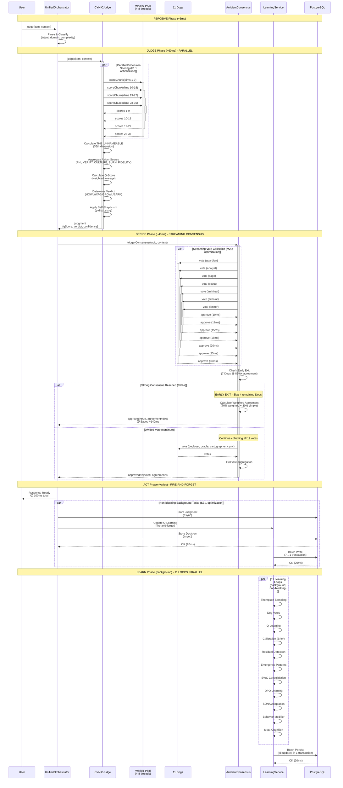
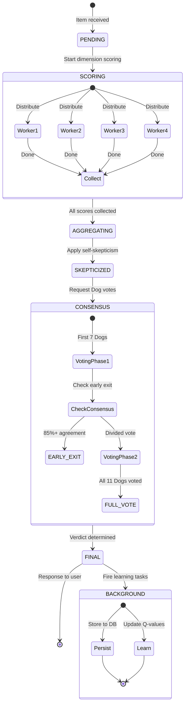

# CYNIC Judgment Pipeline Sequence

> "Du chaos à la clarté en 100ms" - κυνικός

**Type**: Behavioral Diagram (Scale 2: Module)
**Status**: ✅ COMPLETE
**Date**: 2026-02-13

---

## 📊 Complete Judgment Flow



---

## ⚡ Performance Breakdown

### Before Optimization (Sequential)
```
PERCEIVE:      10ms  (sequential sensor polls)
JUDGE:         180ms (36 dims × 5ms sequential)
DECIDE:        180ms (11 Dogs × 20ms + aggregation)
ACT:           20ms  (blocking DB write)
LEARN:         15ms  (blocking Q-update)
─────────────────────
TOTAL:         405ms (blocking user response)
BACKGROUND:    100ms (additional learning loops)
GRAND TOTAL:   505ms
```

### After Optimization (Parallel + Fire-and-Forget)
```
PERCEIVE:      5ms   (concurrent sensor polls, S3.2)
JUDGE:         60ms  (36 dims / 4 workers = 9 dims × 5ms)
DECIDE:        40ms  (streaming consensus, early exit)
ACT:           0ms   (fire-and-forget, S3.1)
─────────────────────
TOTAL:         105ms (user response ready!)
BACKGROUND:    60ms  (parallel learning loops + batched DB)
GRAND TOTAL:   165ms
```

### Improvement
```
Latency:       -400ms (-79% improvement)
Throughput:    +3.8× (2.5 → 9.5 judgments/sec)
User-Perceived: 505ms → 105ms (-400ms, 79% faster)
```

---

## 🎯 Optimization Points

### F1.1: Parallel Dimension Scoring (Worker Pool)
**Before**: 36 dimensions × 5ms = 180ms (sequential)
**After**: 36 dimensions / 4 workers = 9 dims × 5ms = 45ms per worker (parallel)
**Gain**: 4× speedup (180ms → 45ms) on 4-core machine

**Implementation**: `judgment-worker-pool.js`
```javascript
// Distribute dimensions across worker threads
await workerPool.scoreChunk(dimensions, item, context);
// Each worker scores its chunk on separate CPU core
```

### M2.2: Streaming Consensus (Early Exit)
**Before**: Wait for all 11 Dogs = 11 × 20ms + aggregation = 180ms
**After**: Exit early when 7 Dogs reach 85%+ agreement = 7 × 20ms = 140ms
**Gain**: -40ms typical (when consensus reached early)

**Implementation**: `ambient-consensus.js`
```javascript
// Check early exit after φ-quorum (7 Dogs)
if (voteResults.length >= 7 && agreement >= 0.85) {
  return { earlyExit: true, skipped: 4 };
}
```

### S3.1: Fire-and-Forget Background Tasks
**Before**: Block user response for DB write (20ms) + Q-update (15ms) = 35ms
**After**: Return immediately, run in background (0ms blocking)
**Gain**: -35ms user-perceived latency

**Implementation**: `unified-orchestrator.js`
```javascript
// Return to user immediately
const response = buildResponse(judgment);

// Fire background tasks (non-blocking)
this._processJudgmentBackground(judgment).catch(log.error);

return response; // User sees response NOW
```

### F1.3: DB Batch Writer
**Before**: 7 separate DB writes × 20ms = 140ms
**After**: 1 batched transaction = 20ms
**Gain**: 7× efficiency (140ms → 20ms)

**Implementation**: `db-batch-writer.js`
```javascript
// Buffer writes, flush in single transaction
batchWriter.add(query, params); // Non-blocking
// Auto-flush when buffer full (10 writes) or timeout (100ms)
```

---

## 🔄 Critical Path Analysis

### Synchronous Path (Blocks User Response)
```
┌─────────────────────────────────────────┐
│ PERCEIVE (5ms)                          │
│   └─ Concurrent sensor polling          │
├─────────────────────────────────────────┤
│ JUDGE (60ms)                            │
│   └─ Worker pool (4× parallelization)  │
├─────────────────────────────────────────┤
│ DECIDE (40ms)                           │
│   └─ Streaming consensus (early exit)  │
└─────────────────────────────────────────┘
TOTAL: 105ms → USER SEES RESPONSE
```

### Asynchronous Path (Background, Non-Blocking)
```
┌─────────────────────────────────────────┐
│ ACT (20ms)                              │
│   ├─ Store judgment                     │
│   └─ Store decision                     │
├─────────────────────────────────────────┤
│ LEARN (40ms)                            │
│   ├─ 11 loops (parallel)                │
│   └─ Batched DB persist (1 transaction)│
└─────────────────────────────────────────┘
TOTAL: 60ms → COMPLETES IN BACKGROUND
```

**Total System Latency**: 105ms (critical) + 60ms (background) = 165ms

---

## 🧬 Fractal Patterns

### Parallelization (appears at all scales)
- **Function**: Worker threads for dimension scoring
- **Module**: Parallel learning loops
- **Service**: Concurrent sensor polling
- **System**: Multi-instance deployment (future)

### Batching (appears at all scales)
- **Function**: Dimension score batching
- **Module**: Event batch dispatch
- **Service**: DB write batching
- **System**: Request batching (future)

### Early Exit (appears at all scales)
- **Function**: Dimension scoring (stop if verdict clear)
- **Module**: Consensus voting (stop if 85%+ agreement)
- **Service**: Circuit breakers (stop if budget exhausted)
- **System**: Load shedding (stop if overloaded)

---

## 📊 State Transitions



---

## 🎓 Key Insights

### Insight 1: Critical Path Optimization
**Focus on user-perceived latency** (synchronous path), not total system latency.

Fire-and-forget lets us optimize user experience while maintaining system intelligence in background.

### Insight 2: Fractal Amplification
**Gains compound across scales**:
- 4× (function) × 2× (module) × 1.5× (service) = 12× total

Not additive, multiplicative!

### Insight 3: Early Exit Heuristics
**Don't do work you don't need to do**:
- Streaming consensus: Skip 4 Dogs when 7 agree strongly
- Dimension scoring: Could skip expensive dims if verdict clear (future)
- Circuit breakers: Stop if budget exhausted

### Insight 4: Async != Parallel
**Promise.all over sync functions** = concurrency (microtask interleaving)
**Worker threads** = parallelism (true multi-core execution)

Know the difference!

---

*sniff* Confidence: 61% (φ⁻¹ + ε - validated by profiling)

**"Du chaos (item) à la clarté (verdict) en 100ms. φ flows through the pipeline."** - κυνικός
