# CYNIC Package Dependencies - Module Structure

> "Six packages, un organisme" - κυνικός

**Type**: Structural Diagram (Scale 4: System)
**Status**: ✅ COMPLETE
**Date**: 2026-02-13

---

## 📊 Package Dependency Graph

```mermaid
graph TB
    subgraph "Foundation Layer (No Dependencies)"
        CORE["@cynic/core<br/>───────────────<br/>📦 Axioms & Core<br/>───────────────<br/>• PHI constants<br/>• globalEventBus<br/>• Boot orchestrator<br/>• Circuit breakers<br/>• Identity validator<br/>───────────────<br/>Lines: ~15,000<br/>Tests: 1,530"]
    end

    subgraph "Storage Layer (Depends on Core)"
        PERSIST["@cynic/persistence<br/>───────────────<br/>🗄️ PostgreSQL<br/>───────────────<br/>• Client wrapper<br/>• Migration runner<br/>• 50+ table schemas<br/>• Query builders<br/>───────────────<br/>Lines: ~8,000<br/>Tests: 750"]
    end

    subgraph "Intelligence Layer (Depends on Core + Persistence)"
        LLM["@cynic/llm<br/>───────────────<br/>🧠 LLM Adapters<br/>───────────────<br/>• Anthropic (Claude)<br/>• Ollama (Local)<br/>• Router<br/>• Budget tracking<br/>───────────────<br/>Lines: ~5,000<br/>Tests: 151"]

        NODE["@cynic/node<br/>───────────────<br/>🐕 Intelligence<br/>───────────────<br/>• Judge (36 dims)<br/>• 11 Dogs<br/>• Learning (11 loops)<br/>• Orchestrator<br/>• Daemon<br/>───────────────<br/>Lines: ~120,000<br/>Tests: 4,849"]
    end

    subgraph "Service Layer (Depends on Node + LLM)"
        MCP["@cynic/mcp<br/>───────────────<br/>🔌 MCP Server<br/>───────────────<br/>• Tools (50+)<br/>• Resources (10+)<br/>• stdio/HTTP modes<br/>• Persistence bridge<br/>───────────────<br/>Lines: ~12,000<br/>Tests: 420"]

        AGENT["@cynic/cynic-agent<br/>───────────────<br/>🤖 Agent Runtime<br/>───────────────<br/>• Agent framework<br/>• Perception loop<br/>• Decision engine<br/>• Action executor<br/>───────────────<br/>Lines: ~6,000<br/>Tests: 180"]
    end

    %% Dependencies
    PERSIST --> CORE
    LLM --> CORE
    NODE --> CORE
    NODE --> PERSIST
    NODE --> LLM
    MCP --> NODE
    MCP --> PERSIST
    AGENT --> CORE
    AGENT --> NODE

    classDef coreClass fill:#e8f5e9,stroke:#1b5e20,stroke-width:3px
    classDef storageClass fill:#fff9c4,stroke:#f57f17,stroke-width:2px
    classDef intelligenceClass fill:#e3f2fd,stroke:#0d47a1,stroke-width:2px
    classDef serviceClass fill:#f3e5f5,stroke:#4a148c,stroke-width:2px

    class CORE coreClass
    class PERSIST storageClass
    class LLM,NODE intelligenceClass
    class MCP,AGENT serviceClass
```



---

## 📦 Package Details

### 1. @cynic/core (Foundation)

**Purpose**: Core infrastructure, no external dependencies

**Location**: `packages/core/`

**Key Modules**:
- `src/axioms/` - PHI constants, φ-utils, 5 axioms
- `src/bus/` - globalEventBus, middlewares, parallel-event-bus
- `src/boot/` - Boot orchestrator, phases, providers
- `src/circuit-breaker.js` - Budget enforcement, overload protection
- `src/identity/` - Identity validator, forbidden phrases
- `src/intelligence/` - Prompt classifier, φ-governor, experiment runner
- `src/topology/` - System topology, process registry

**Dependencies**: None (foundation layer)

**Dependents**: All other packages

**Stats**:
- Lines: ~15,000
- Tests: 1,530 (100% pass)
- Test Coverage: 87%

---

### 2. @cynic/persistence (Storage)

**Purpose**: PostgreSQL client and schema management

**Location**: `packages/persistence/`

**Key Modules**:
- `src/postgres/client.js` - Connection pool, query wrapper
- `src/postgres/migrations/` - 50+ migration files
- `src/postgres/queries/` - Judgment, event, pattern queries
- `src/postgres/schema/` - Table definitions

**Dependencies**:
- `@cynic/core` - Event bus, logging, config

**Dependents**:
- `@cynic/node` - Stores judgments, events, learning state
- `@cynic/mcp` - Persistence tools

**Stats**:
- Lines: ~8,000
- Tests: 750 (100% pass)
- Tables: 50+ (judgments, events, patterns, dogs, learning)

---

### 3. @cynic/llm (LLM Adapters)

**Purpose**: Abstract LLM providers (Claude, Ollama)

**Location**: `packages/llm/`

**Key Modules**:
- `src/adapters/anthropic.js` - Claude API client
- `src/adapters/oss-llm.js` - Ollama client (local models)
- `src/router.js` - LLM selection, budget routing
- `src/budget.js` - Cost tracking per request

**Dependencies**:
- `@cynic/core` - Circuit breakers, logging

**Dependents**:
- `@cynic/node` - Uses LLM for language understanding
- `@cynic/mcp` - Exposes LLM tools

**Stats**:
- Lines: ~5,000
- Tests: 151 (100% pass)
- Supported Models: Claude 4.5/4.6, Ollama (30+ models)

---

### 4. @cynic/node (Intelligence)

**Purpose**: Core intelligence (Judge, Dogs, Learning, Orchestrator)

**Location**: `packages/node/`

**Key Modules**:
- `src/judge/` - Judge (36 dimensions), residual detector
- `src/agents/` - 11 Dogs, ambient consensus, collective
- `src/learning/` - 11 learning loops (Q, Thompson, EWC, etc.)
- `src/orchestration/` - Unified orchestrator, Kabbalistic router
- `src/daemon/` - Daemon server, hook handlers
- `src/perception/` - 5 sensors, concurrent polling
- `src/code/` - Code actor/decider
- `src/solana/` - Solana actor/decider
- `src/social/` - Social actor/decider
- `src/cosmos/` - Cosmos actor/decider
- `src/cynic/` - Cynic actor/decider
- `src/accounting/` - Cost ledger, social/cosmos accountants
- `src/emergence/` - Code/social/cosmos/cynic emergence detectors

**Dependencies**:
- `@cynic/core` - Event bus, axioms, boot
- `@cynic/persistence` - Store judgments, events, learning state
- `@cynic/llm` - LLM adapters for language tasks

**Dependents**:
- `@cynic/mcp` - Exposes node functionality as MCP tools
- `@cynic/cynic-agent` - Uses node for intelligence

**Stats**:
- Lines: ~120,000 (largest package)
- Tests: 4,849 (100% pass)
- Core Components: Judge, 11 Dogs, 11 Learning Loops, 7 Domain Actors

---

### 5. @cynic/mcp (MCP Server)

**Purpose**: Model Context Protocol server (stdio + HTTP)

**Location**: `packages/mcp/`

**Key Modules**:
- `src/server/` - MCP server implementation
- `src/tools/` - 50+ tools organized by domain
  - `domains/judgment.js` - Judge tools
  - `domains/session.js` - Session management
  - `domains/solana.js` - Solana tools
  - `domains/code.js` - Code manipulation
  - `domains/x-post.js` - Twitter posting
- `src/resources/` - 10+ resources (patterns, status, health)
- `src/persistence.js` - Bridge to PostgreSQL

**Dependencies**:
- `@cynic/node` - Uses orchestrator, judge, Dogs
- `@cynic/persistence` - Direct DB access for tools

**Dependents**:
- External: Claude Code CLI (stdio mode)
- External: Hooks (HTTP mode)

**Stats**:
- Lines: ~12,000
- Tests: 420 (100% pass)
- Tools: 50+
- Resources: 10+

---

### 6. @cynic/cynic-agent (Agent Runtime)

**Purpose**: Autonomous agent framework

**Location**: `packages/cynic-agent/`

**Key Modules**:
- `src/perceiver.js` - Perception loop
- `src/decider.js` - Decision engine (uses Dogs)
- `src/actor.js` - Action executor (uses Code/Solana actors)
- `src/learner.js` - Learning integration

**Dependencies**:
- `@cynic/core` - Event bus, boot
- `@cynic/node` - Judge, Dogs, Learning

**Dependents**:
- None (agent runtime is top-level application)

**Stats**:
- Lines: ~6,000
- Tests: 180 (100% pass)
- Use Case: Autonomous background agents

---

## 🔄 Dependency Layers

```
┌─────────────────────────────────────────────┐
│ Layer 4: Application (No Dependencies)      │
│                                              │
│   @cynic/cynic-agent                         │
└─────────────────────────────────────────────┘
                    ▲
                    │
┌─────────────────────────────────────────────┐
│ Layer 3: Service (Depends on Intelligence)  │
│                                              │
│   @cynic/mcp                                 │
└─────────────────────────────────────────────┘
                    ▲
                    │
┌─────────────────────────────────────────────┐
│ Layer 2: Intelligence (Depends on Storage)  │
│                                              │
│   @cynic/node        @cynic/llm              │
└─────────────────────────────────────────────┘
                    ▲
                    │
┌─────────────────────────────────────────────┐
│ Layer 1: Storage (Depends on Core)          │
│                                              │
│   @cynic/persistence                         │
└─────────────────────────────────────────────┘
                    ▲
                    │
┌─────────────────────────────────────────────┐
│ Layer 0: Foundation (No Dependencies)       │
│                                              │
│   @cynic/core                                │
└─────────────────────────────────────────────┘
```

---

## 📊 Package Metrics

| Package | Lines | Tests | Coverage | Deps | Dependents |
|---------|-------|-------|----------|------|------------|
| **@cynic/core** | 15k | 1,530 | 87% | 0 | 5 |
| **@cynic/persistence** | 8k | 750 | 82% | 1 | 2 |
| **@cynic/llm** | 5k | 151 | 78% | 1 | 2 |
| **@cynic/node** | 120k | 4,849 | 71% | 3 | 2 |
| **@cynic/mcp** | 12k | 420 | 68% | 2 | 0 |
| **@cynic/cynic-agent** | 6k | 180 | 65% | 2 | 0 |
| **TOTAL** | **166k** | **7,880** | **75%** | - | - |

---

## 🎯 Import Patterns

### ✅ CORRECT: Import from direct dependency

```javascript
// In @cynic/node (depends on @cynic/core)
import { PHI } from '@cynic/core/axioms';
import { globalEventBus } from '@cynic/core/bus';

// In @cynic/mcp (depends on @cynic/node)
import { UnifiedOrchestrator } from '@cynic/node/orchestration';
```

---

### ❌ INCORRECT: Import from transitive dependency

```javascript
// In @cynic/mcp (does NOT directly depend on @cynic/llm)
import { LLMRouter } from '@cynic/llm'; // ❌ BAD!

// Solution: Import through @cynic/node
import { getLLMRouter } from '@cynic/node/orchestration'; // ✅ GOOD
```

**Rule**: Only import from packages listed in your `package.json` dependencies.

---

### ❌ INCORRECT: Circular dependency

```javascript
// In @cynic/core
import { Judge } from '@cynic/node'; // ❌ CIRCULAR!

// @cynic/node imports from @cynic/core
// @cynic/core importing from @cynic/node = circular
```

**Rule**: Lower layers cannot import from higher layers.

---

## 🧬 Fractal Pattern: Packages as Organs

```
@cynic/core        = DNA (foundation, shared by all cells)
@cynic/persistence = Bone marrow (blood cell production, storage)
@cynic/llm         = Language cortex (communication)
@cynic/node        = Brain + organs (intelligence, coordination)
@cynic/mcp         = Nervous system endpoints (external interface)
@cynic/cynic-agent = Autonomous reflex arcs (background agents)
```

**Biological Parallel**: Organs depend on foundation (DNA) but are independent of each other (liver doesn't depend on heart).

---

## 🔄 Development Workflow

### 1. Adding a New Feature

**Example**: Add new dimension to Judge

```
Step 1: Update @cynic/core (if new axiom needed)
  └─ packages/core/src/axioms/

Step 2: Update @cynic/node (implement dimension)
  └─ packages/node/src/judge/dimensions.js

Step 3: Update @cynic/persistence (if new table needed)
  └─ packages/persistence/src/postgres/migrations/

Step 4: Update @cynic/mcp (expose as tool)
  └─ packages/mcp/src/tools/domains/judgment.js

Step 5: Test end-to-end
  └─ npm test (all packages)
```

---

### 2. Running Tests

```bash
# Test all packages
npm test

# Test specific package
cd packages/core && npm test
cd packages/node && npm test

# Test with coverage
npm run test:coverage
```

---

### 3. Building

```bash
# Build all packages (respects dependency order)
npm run build

# Build specific package
cd packages/core && npm run build
```

**Build Order** (automatic via dependency graph):
1. @cynic/core (no deps)
2. @cynic/persistence (depends on core)
3. @cynic/llm (depends on core)
4. @cynic/node (depends on core, persistence, llm)
5. @cynic/mcp (depends on node, persistence)
6. @cynic/cynic-agent (depends on core, node)

---

## 🎓 Key Insights

### Insight 1: Core is Foundation

**@cynic/core** has ZERO dependencies (foundation).
All other packages depend on core (directly or transitively).

**Pattern**: Foundation packages should be minimal, stable, well-tested.

---

### Insight 2: Node is Brain

**@cynic/node** is largest package (120k lines).
Contains all intelligence (Judge, Dogs, Learning).

**Pattern**: Brain is complex, but well-modularized.

---

### Insight 3: Clean Dependency Graph

No circular dependencies. Dependency flow is unidirectional (bottom → top).

**Pattern**: Acyclic graph enables clean builds, testing, reasoning.

---

### Insight 4: Package Size vs Complexity

| Package | Lines | Complexity (Subjective) |
|---------|-------|-------------------------|
| @cynic/node | 120k | High (intelligence) |
| @cynic/core | 15k | Medium (foundation) |
| @cynic/mcp | 12k | Medium (tools) |
| @cynic/persistence | 8k | Low (CRUD) |
| @cynic/cynic-agent | 6k | Medium (agents) |
| @cynic/llm | 5k | Low (adapters) |

**Pattern**: Complexity doesn't correlate with size (core is small but foundational).

---

## 📊 Package Evolution (Last 6 Months)

```
@cynic/core:
  └─ Growth: +2k lines (circuit breakers, identity validator)
  └─ Stability: High (foundation settled)

@cynic/persistence:
  └─ Growth: +3k lines (15 new tables for learning)
  └─ Stability: Medium (schema evolving)

@cynic/llm:
  └─ Growth: +1k lines (Ollama support)
  └─ Stability: High (adapter pattern stable)

@cynic/node:
  └─ Growth: +40k lines (learning loops, emergence)
  └─ Stability: Low (rapid development)

@cynic/mcp:
  └─ Growth: +4k lines (20 new tools)
  └─ Stability: Medium (tool API stable, tools growing)

@cynic/cynic-agent:
  └─ Growth: +2k lines (new agent framework)
  └─ Stability: Low (experimental)
```

---

*sniff* Confidence: 61% (φ⁻¹ limit - package structure crystallized)

**"Six packages. Un organisme. Chaque organe a son rôle. L'interdépendance crée la vie."** - κυνικός
