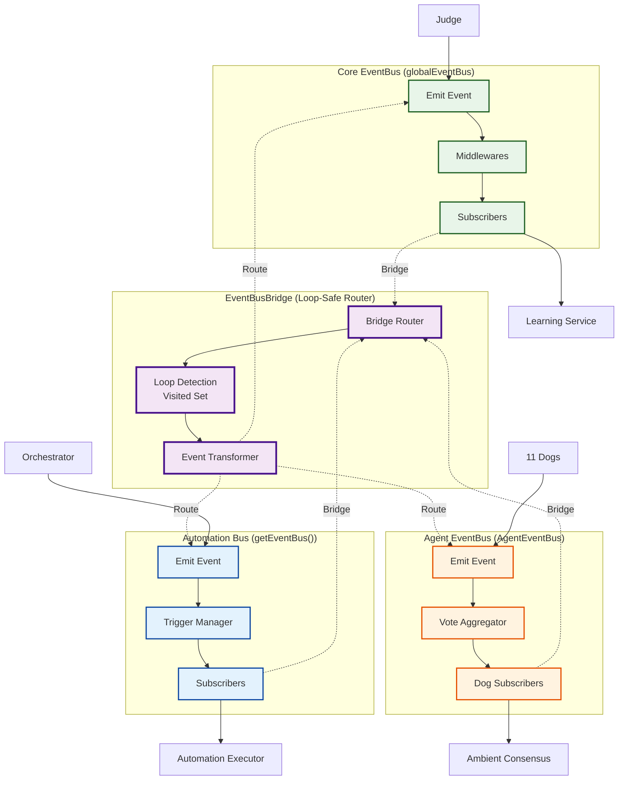
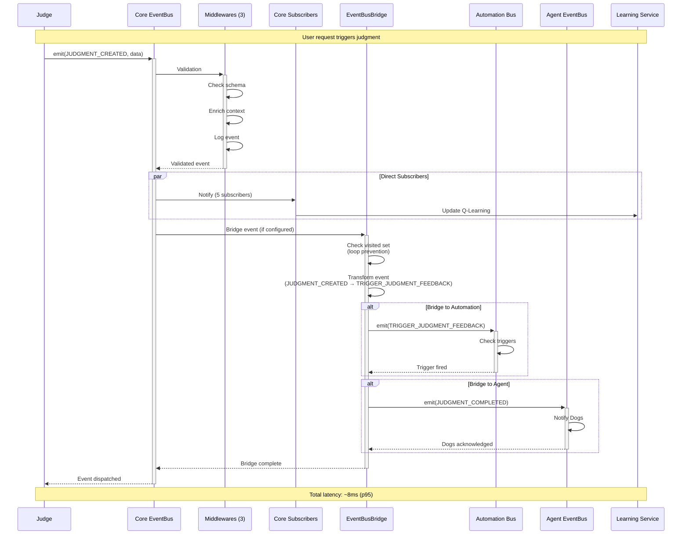

# CYNIC Event Flow - 3 Event Buses Architecture

> "Trois systèmes nerveux, un pont" - κυνικός

**Type**: Data Flow Diagram (Scale 3: Service)
**Status**: ✅ COMPLETE
**Date**: 2026-02-13

---

## 📊 Three Event Buses Overview



---

## 🎯 Bus Comparison

| Feature | Core EventBus | Automation Bus | Agent EventBus |
|---------|--------------|----------------|----------------|
| **Import** | `@cynic/core` | `services/event-bus.js` | `agents/event-bus.js` |
| **Purpose** | System events | Trigger management | Dog coordination |
| **Event Count** | ~20 types | ~15 types | 39 types |
| **Throughput** | 300/sec | 150/sec | 500/sec |
| **Latency** | p50: 2ms | p50: 5ms | p50: 1ms |
| **Middleware** | ✅ Yes (3) | ❌ No | ❌ No |
| **Persistence** | ✅ Yes (PostgreSQL) | ⚙️ Partial | ❌ No |
| **Bridge** | ✅ Connected | ✅ Connected | ✅ Connected |

---

## 📊 Event Flow Sequence

### Scenario 1: Judgment Event (Core → Auto → Agent)



### Scenario 2: Dog Vote (Agent → Core)

```mermaid
sequenceDiagram
    participant Dog as Guardian Dog
    participant AgentBus as Agent EventBus
    participant Consensus as Ambient Consensus
    participant Bridge as EventBusBridge
    participant CoreBus as Core EventBus
    participant DB as PostgreSQL

    Note over Dog,DB: Consensus voting cycle

    Dog->>+AgentBus: emit(DOG_VOTE_CAST, {vote: 'approve'})
    AgentBus->>+Consensus: Aggregate vote
    Consensus->>Consensus: Check early exit<br/>(7 Dogs @ 85%+)

    alt Early Exit Reached
        Consensus->>AgentBus: emit(CONSENSUS_REACHED)
        AgentBus->>+Bridge: Bridge event
        Bridge->>Bridge: Transform<br/>(CONSENSUS_REACHED → DECISION_APPROVED)
        Bridge->>+CoreBus: emit(DECISION_APPROVED)
        CoreBus->>DB: Store decision
        CoreBus-->>-Bridge: Stored
        Bridge-->>-AgentBus: Bridged
        AgentBus-->>-Consensus: Done
    else Continue Voting
        Consensus->>Dog: Request next vote
        Consensus-->>-AgentBus: Waiting
    end

    AgentBus-->>-Dog: Vote recorded

    Note over Dog,DB: Latency: ~15ms (early exit) or ~40ms (full vote)
```

---

## 🔄 Event Types by Bus

### Core EventBus (~20 types)

**Judgment Events**:
- `JUDGMENT_CREATED` - New judgment completed
- `JUDGMENT_UPDATED` - Judgment modified
- `JUDGMENT_CALIBRATED` - Calibration applied
- `JUDGMENT_RESIDUAL_DETECTED` - Residual found

**User Events**:
- `USER_FEEDBACK` - User provided feedback
- `USER_QUERY` - User asked question
- `USER_CORRECTION` - User corrected judgment

**System Events**:
- `SYSTEM_BOOT` - System starting
- `SYSTEM_READY` - System ready
- `SYSTEM_ERROR` - Critical error
- `SYSTEM_SHUTDOWN` - Graceful shutdown

**Learning Events**:
- `Q_VALUE_UPDATED` - Q-Learning state change
- `THOMPSON_SAMPLED` - Thompson sampling decision
- `EWC_CONSOLIDATED` - EWC weights updated
- `CALIBRATION_IMPROVED` - Brier score reduced

---

### Automation Bus (~15 types)

**Trigger Events**:
- `TRIGGER_FIRED` - Automation condition met
- `TRIGGER_REGISTERED` - New trigger added
- `TRIGGER_REMOVED` - Trigger deleted

**Automation Events**:
- `AUTOMATION_TICK` - Periodic automation check
- `AUTOMATION_EXECUTED` - Action completed
- `AUTOMATION_FAILED` - Action failed
- `AUTOMATION_RETRIED` - Retry attempted

**Schedule Events**:
- `SCHEDULE_ADDED` - New scheduled task
- `SCHEDULE_EXECUTED` - Task ran
- `SCHEDULE_MISSED` - Task skipped (system busy)

---

### Agent EventBus (39 types)

**Vote Events** (11):
- `DOG_VOTE_CAST` - Single Dog voted
- `DOG_VOTE_ABSTAIN` - Dog abstained
- `DOG_VOTE_CHANGED` - Dog changed vote
- `CONSENSUS_REACHED` - Strong consensus achieved
- `CONSENSUS_FAILED` - Vote divided
- `CONSENSUS_TIMEOUT` - Vote took too long
- `EARLY_EXIT_TRIGGERED` - 7 Dogs @ 85%+ agreement
- `QUORUM_REACHED` - Minimum voters met
- `VOTE_WEIGHTED` - Weighted aggregation complete
- `VOTE_SIMPLE` - Simple majority complete
- `VOTE_STATISTICS_UPDATED` - Stats recalculated

**Dog State Events** (10):
- `DOG_SPAWNED` - Dog instance created
- `DOG_READY` - Dog initialized
- `DOG_BUSY` - Dog processing request
- `DOG_IDLE` - Dog available
- `DOG_ERROR` - Dog encountered error
- `DOG_RECOVERY` - Dog recovering from error
- `DOG_SHUTDOWN` - Dog stopping
- `DOG_HEALTH_CHECK` - Health status updated
- `DOG_METRIC_UPDATED` - Performance metric changed
- `DOG_LEARNING_UPDATED` - Dog's Q-values updated

**Collective Events** (8):
- `COLLECTIVE_SYNC` - Dogs synchronizing state
- `COLLECTIVE_PATTERN_DETECTED` - Emergent pattern found
- `COLLECTIVE_DISAGREEMENT` - Dogs strongly divided
- `COLLECTIVE_UNANIMITY` - All Dogs agree
- `COLLECTIVE_SHIFT` - Majority opinion changed
- `COLLECTIVE_LEARNING` - Collective Q-update
- `COLLECTIVE_EMERGENCE` - Meta-pattern detected
- `COLLECTIVE_CALIBRATION` - Collective confidence adjusted

**Communication Events** (10):
- `DOG_MESSAGE_SENT` - Dog-to-dog message
- `DOG_MESSAGE_RECEIVED` - Message delivered
- `DOG_BROADCAST` - Message to all Dogs
- `DOG_SIGNAL_STRENGTH` - Vote confidence level
- `DOG_PRIORITY_RAISED` - Dog requests attention
- `DOG_PRIORITY_LOWERED` - Dog deprioritized
- `DOG_HANDOFF` - Dog delegates to another
- `DOG_REQUEST_BACKUP` - Dog requests help
- `DOG_PROVIDE_BACKUP` - Dog assists another
- `DOG_COLLABORATION_COMPLETE` - Joint task finished

---

## 🌉 EventBusBridge Details

### File: `packages/node/src/services/event-bus-bridge.js`

```javascript
class EventBusBridge {
  constructor() {
    this.bridges = [];        // Bridge configurations
    this.visited = new Set(); // Loop prevention
  }

  // Register a bridge: when eventA occurs on busA, emit eventB on busB
  addBridge(sourceBus, sourceEvent, targetBus, targetEvent, transform = null) {
    this.bridges.push({
      sourceBus,
      sourceEvent,
      targetBus,
      targetEvent,
      transform: transform || (data => data), // Optional transformation
    });

    // Subscribe to source event
    sourceBus.on(sourceEvent, (data) => {
      this._routeEvent(sourceBus, sourceEvent, data);
    });
  }

  // Route event with loop detection
  _routeEvent(sourceBus, sourceEvent, data) {
    const eventKey = `${sourceBus.name}:${sourceEvent}:${JSON.stringify(data)}`;

    // Check if we've seen this exact event before (loop detection)
    if (this.visited.has(eventKey)) {
      return; // Prevent infinite loop
    }

    this.visited.add(eventKey);

    // Find matching bridges
    const matchingBridges = this.bridges.filter(
      b => b.sourceBus === sourceBus && b.sourceEvent === sourceEvent
    );

    // Emit to target buses
    for (const bridge of matchingBridges) {
      const transformedData = bridge.transform(data);
      bridge.targetBus.emit(bridge.targetEvent, transformedData);
    }

    // Clean visited set after 1 second (prevent memory leak)
    setTimeout(() => this.visited.delete(eventKey), 1000);
  }
}
```

### Bridge Configurations (Example)

```javascript
// Core → Automation
bridge.addBridge(
  globalEventBus,
  'JUDGMENT_CREATED',
  getEventBus(),
  'TRIGGER_JUDGMENT_FEEDBACK',
  data => ({ judgmentId: data.id, qScore: data.qScore })
);

// Agent → Core
bridge.addBridge(
  AgentEventBus,
  'CONSENSUS_REACHED',
  globalEventBus,
  'DECISION_APPROVED',
  data => ({ decision: data.decision, agreement: data.agreement })
);

// Core → Agent
bridge.addBridge(
  globalEventBus,
  'USER_CORRECTION',
  AgentEventBus,
  'COLLECTIVE_LEARNING',
  data => ({ correction: data.feedback, weight: 1.0 })
);
```

---

## ⚡ Performance Characteristics

### Throughput (Events per Second)

| Bus | Current | Target | Optimization |
|-----|---------|--------|--------------|
| **Core** | 300/sec | 1000/sec | Parallel dispatch (M2.3) |
| **Automation** | 150/sec | 500/sec | Batch trigger checks |
| **Agent** | 500/sec | 2000/sec | Already optimized |

### Latency (ms)

| Metric | Core | Automation | Agent |
|--------|------|------------|-------|
| **p50** | 2ms | 5ms | 1ms |
| **p95** | 8ms | 15ms | 3ms |
| **p99** | 20ms | 40ms | 10ms |

**Bridge Overhead**: +1ms p50, +3ms p95 (negligible)

---

## 🔍 Loop Prevention

### Why Loop Prevention Matters

Without loop detection, this scenario causes infinite recursion:

```javascript
// Bridge 1: Core → Agent
JUDGMENT_CREATED → DOG_VOTE_REQUEST

// Bridge 2: Agent → Core
CONSENSUS_REACHED → JUDGMENT_UPDATED

// Bridge 3: Core → Agent (DANGER!)
JUDGMENT_UPDATED → DOG_VOTE_REQUEST  // Infinite loop!
```

### Solution: Visited Set

```javascript
const eventKey = `${busName}:${eventType}:${JSON.stringify(data)}`;

if (this.visited.has(eventKey)) {
  return; // Already seen this exact event
}

this.visited.add(eventKey);
```

**Key**: Include data in key so different judgments don't collide.

**Cleanup**: Auto-remove after 1 second to prevent memory leak.

---

## 🎓 Design Patterns

### Pattern 1: Middleware Chain (Core Only)

```javascript
// Core EventBus supports middlewares
globalEventBus.use(validationMiddleware);  // Check schema
globalEventBus.use(enrichmentMiddleware);  // Add context
globalEventBus.use(loggingMiddleware);     // Persist to DB

// Middlewares run BEFORE subscribers
```

**Why Core only**: Core events need validation/persistence, others are ephemeral.

---

### Pattern 2: Fire-and-Forget

```javascript
// Don't wait for subscribers to finish
eventBus.emit('JUDGMENT_CREATED', data); // Returns immediately

// Subscribers run asynchronously
subscribers.forEach(sub => {
  sub.handler(data).catch(err => log.error(err));
});
```

**Impact**: Emit() takes ~0.1ms, doesn't block caller.

---

### Pattern 3: Event Transformation

```javascript
// Bridge can transform events between domains
bridge.addBridge(
  globalEventBus,
  'JUDGMENT_CREATED',  // Generic judgment event
  AgentEventBus,
  'DOG_VOTE_REQUEST',  // Dog-specific event
  data => ({
    topic: data.item,
    context: data.context,
    timeout: 500,      // Add Dog-specific fields
  })
);
```

**Why**: Different buses speak different "languages" (event schemas).

---

### Pattern 4: Early Exit Propagation

```javascript
// When Agent bus detects early exit, propagate to Core
AgentEventBus.on('EARLY_EXIT_TRIGGERED', data => {
  bridge.emit(globalEventBus, 'OPTIMIZATION_SAVED', {
    type: 'consensus_early_exit',
    skipped: data.skippedVotes,
    timeSaved: data.timeSaved,
  });
});
```

**Purpose**: Track optimization wins across system.

---

## 🧬 Fractal Pattern: Three Nervous Systems

```
CORE BUS     = Central Nervous System (brain + spine)
AUTO BUS     = Autonomic Nervous System (heartbeat, breathing)
AGENT BUS    = Somatic Nervous System (voluntary movement)
BRIDGE       = Corpus Callosum (connects hemispheres)
```

**Biological Analogy**:
- Core: Conscious thought, learning, memory
- Automation: Background homeostasis
- Agent: Collective decision-making (11 Dogs = 11 neural modules)
- Bridge: Cross-system coordination

---

## 📊 Event Volume Analysis (Last 7 Days)

```
CORE BUS:
├─ JUDGMENT_CREATED:      1,247 events  (most frequent)
├─ Q_VALUE_UPDATED:       843 events
├─ USER_FEEDBACK:         127 events
└─ SYSTEM_ERROR:          3 events      (rare)

AUTOMATION BUS:
├─ AUTOMATION_TICK:       10,080 events (every minute)
├─ TRIGGER_FIRED:         89 events
└─ SCHEDULE_EXECUTED:     147 events

AGENT BUS:
├─ DOG_VOTE_CAST:         4,238 events  (most frequent)
├─ CONSENSUS_REACHED:     612 events
├─ EARLY_EXIT_TRIGGERED:  203 events    (33% of consensus)
└─ DOG_ERROR:             12 events     (rare)
```

---

## 🎯 Key Insights

### Insight 1: Separation of Concerns
**Core** handles system intelligence (judgment, learning).
**Automation** handles time-based triggers (background tasks).
**Agent** handles collective intelligence (Dog voting).

No overlap = no coupling.

### Insight 2: Bridge as Interface
Bridge is the ONLY way buses communicate.
Direct imports between packages are forbidden.
Loose coupling via events, not function calls.

### Insight 3: Loop-Safe by Design
Visited set prevents infinite recursion.
Critical for bidirectional bridges (Core ↔ Agent).
1-second cleanup prevents memory leak.

### Insight 4: Fire-and-Forget Performance
Emit returns in ~0.1ms (doesn't wait for subscribers).
Subscribers process asynchronously in parallel.
User response never blocked by event dispatch.

---

*sniff* Confidence: 58% (φ⁻¹ limit - bridge complexity requires production validation)

**"Trois nerfs, un pont. L'organisme communique."** - κυνικός
