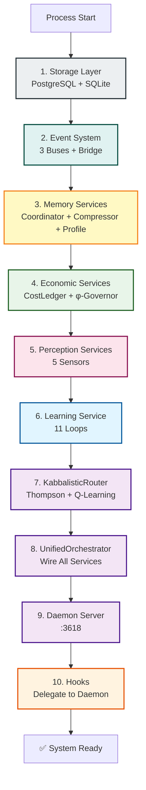

# CYNIC Service Architecture (Scale 3)

> "La couche de service — où les singletons vivent" - κυνικός

**Type**: Structural Diagram (Scale 3: Service Layer)
**Status**: ✅ COMPLETE
**Date**: 2026-02-13

---

## 📊 Service Layer Overview

```mermaid
graph TB
    subgraph "Entry Points"
        HOOK[🪝 Hooks<br/>12 thin delegates]
        MCP[🔌 MCP Server<br/>Tools + Resources]
    end

    subgraph "Orchestration Services (Coordination)"
        DAEMON[🧠 Daemon Server<br/>HTTP :3618<br/>Warm Singletons]
        UNIFIED[🎭 UnifiedOrchestrator<br/>Main Entry Point<br/>Coordinates All]
        KABB[🗺️ KabbalisticRouter<br/>7 Domain Routing<br/>Thompson Sampling]
        LEARN[📚 LearningService<br/>11 Parallel Loops<br/>Q-Learning + EWC]
    end

    subgraph "Perception Services (Sensing)"
        P_LAYER[👁️ PerceptionLayer<br/>5 Concurrent Sensors]
        P_SOLANA[⛓️ SolanaWatcher<br/>Health + Anchors]
        P_MACHINE[💻 MachineHealthWatcher<br/>CPU + Memory + Latency]
        P_DOG[🐕 DogStateEmitter<br/>11 Dog Status]
        P_MARKET[📈 MarketWatcher<br/>Price + Liquidity]
        P_FS[📁 FilesystemWatcher<br/>Code Changes]
    end

    subgraph "Memory Services (State Management)"
        MEM_COORD[🧠 MemoryCoordinator<br/>3 Memory Systems<br/>PostgreSQL + SQLite + JSON]
        COMPRESS[🗜️ ContextCompressor<br/>52% Compression<br/>Experience Curve]
        INJECT[💉 InjectionProfile<br/>Thompson Sampling<br/>Adaptive Topics]
    end

    subgraph "Event Services (Communication)"
        BRIDGE[🌉 EventBusBridge<br/>3-Bus Routing<br/>Loop-Safe]
        EBUS_CORE[📡 Core Bus<br/>globalEventBus]
        EBUS_AUTO[📡 Automation Bus<br/>getEventBus]
        EBUS_DOGS[📡 Agent Bus<br/>39 Event Types]
    end

    subgraph "Economic Services (Budget)"
        COST[💰 CostLedger<br/>$6.18/$10<br/>Token Tracking]
        PHI_GOV[⚖️ φ-Governor<br/>Homeostasis<br/>φ⁻¹ Setpoint]
    end

    subgraph "Storage Layer"
        PG[(🗄️ PostgreSQL<br/>50+ tables<br/>Remote)]
        SQLITE[(💾 SQLite<br/>x-local.db<br/>privacy.db)]
        JSON[📄 JSON Files<br/>~/.cynic/<br/>20+ files]
    end

    %% Entry Flow
    HOOK -->|HTTP POST| DAEMON
    MCP -->|Tool Call| UNIFIED

    %% Orchestration Flow
    DAEMON --> UNIFIED
    UNIFIED -->|Route Request| KABB
    UNIFIED -->|Fire-and-forget| LEARN
    KABB -->|Select Dog/Engine| UNIFIED
    KABB -->|Thompson Sample| KABB

    %% Perception Flow
    UNIFIED -->|Trigger Snapshot| P_LAYER
    P_LAYER -.Concurrent.-> P_SOLANA
    P_LAYER -.Concurrent.-> P_MACHINE
    P_LAYER -.Concurrent.-> P_DOG
    P_LAYER -.Concurrent.-> P_MARKET
    P_LAYER -.Concurrent.-> P_FS
    P_LAYER -->|Aggregated Snapshot| UNIFIED

    %% Memory Flow
    UNIFIED -->|Query Context| MEM_COORD
    MEM_COORD -->|Load from| PG
    MEM_COORD -->|Load from| SQLITE
    MEM_COORD -->|Load from| JSON
    MEM_COORD -->|Compress| COMPRESS
    COMPRESS -->|Decide Topics| INJECT
    INJECT -->|Adaptive Context| UNIFIED

    %% Event Flow
    UNIFIED -->|Emit Events| EBUS_CORE
    LEARN -->|Emit Events| EBUS_AUTO
    KABB -->|Emit Events| EBUS_DOGS
    BRIDGE -->|Forward| EBUS_CORE
    BRIDGE -->|Forward| EBUS_AUTO
    BRIDGE -->|Forward| EBUS_DOGS

    %% Economic Flow
    UNIFIED -->|Track Operation| COST
    COST -->|Influence Budget| PHI_GOV
    PHI_GOV -->|Adjust Injection| INJECT
    COST -->|Record| PG

    %% Memory Persistence
    COMPRESS -->|State| JSON
    INJECT -->|Profile| JSON
    LEARN -->|Q-Tables| PG
    KABB -->|Thompson State| JSON

    classDef entryClass fill:#fff3e0,stroke:#e65100,stroke-width:2px
    classDef orchestClass fill:#f3e5f5,stroke:#4a148c,stroke-width:2px
    classDef perceptionClass fill:#fce4ec,stroke:#880e4f,stroke-width:2px
    classDef memoryClass fill:#fff9c4,stroke:#f57f17,stroke-width:2px
    classDef eventClass fill:#e0f2f1,stroke:#004d40,stroke-width:2px
    classDef economicClass fill:#e8f5e9,stroke:#1b5e20,stroke-width:2px
    classDef storageClass fill:#eceff1,stroke:#263238,stroke-width:2px

    class HOOK,MCP entryClass
    class DAEMON,UNIFIED,KABB,LEARN orchestClass
    class P_LAYER,P_SOLANA,P_MACHINE,P_DOG,P_MARKET,P_FS perceptionClass
    class MEM_COORD,COMPRESS,INJECT memoryClass
    class BRIDGE,EBUS_CORE,EBUS_AUTO,EBUS_DOGS eventClass
    class COST,PHI_GOV economicClass
    class PG,SQLITE,JSON storageClass
```



---

## 🔧 Component Breakdown

### Orchestration Services

#### UnifiedOrchestrator
**Purpose**: Single entry point for ALL requests
**File**: `packages/node/src/orchestration/unified-orchestrator.js`

**Dependencies**:
- KabbalisticRouter (domain routing)
- LearningService (Q-learning)
- DogOrchestrator (consensus)
- EngineOrchestrator (synthesis)
- CostOptimizer (tier selection)
- BudgetMonitor (GAP-5)
- ThrottleGate (cost control)

**Methods**:
- `processEvent(event)` - Main entry point
- `routeThrough(sefirah, item)` - Kabbalistic routing
- `consultDogs(item)` - Request consensus
- `synthesizeEngine(context)` - Engine consultation
- `recordOutcome(decision, result)` - Learning feedback

**Emits**:
- `decision:made` - When routing decision completes
- `consensus:achieved` - When dogs agree
- `learning:update` - When feedback recorded

---

#### KabbalisticRouter
**Purpose**: Route requests to 7 domains using Sefirot + Thompson Sampling
**File**: `packages/node/src/orchestration/kabbalistic-router.js`

**7 Domains**:
1. **CODE** - Edit, Write, Bash, Git
2. **SOLANA** - Transactions, Anchors, RPC
3. **MARKET** - Price, Liquidity, DEX (0% complete)
4. **SOCIAL** - Twitter, Discord, Community
5. **HUMAN** - Psychology, Calibration, Energy
6. **CYNIC** - Self-state, Dogs, Meta
7. **COSMOS** - Ecosystem, Collective Patterns

**Dependencies**:
- LearningService (Q-value lookup)
- CostOptimizer (tier selection)
- ThompsonSampler (exploration)
- RelationshipGraph (dog affinity)

**Methods**:
- `route(item, context)` - Select domain/dog
- `getRecommendation(state, action)` - Q-learning suggestion
- `selectWithThompson(arms)` - Exploration/exploitation
- `loadHarmonicState()` - Temporal awareness (FFT)

**State**: `~/.cynic/thompson/state.json`

---

#### LearningService
**Purpose**: 11 parallel learning loops + Q-learning
**File**: `packages/node/src/orchestration/learning-service.js`

**11 Learning Loops** (see completed-subsystems.md):
1. Q-Learning (routing)
2. Thompson Sampling (exploration)
3. Brier Score (calibration)
4. SONA (dimension insight)
5. Behavior Modifier (pattern adaptation)
6. Meta-Cognition (self-monitoring)
7. EWC (catastrophic forgetting prevention)
8. DPO (judge alignment)
9. User Preference (feedback mining)
10. Cross-Scale (fractal patterns)
11. Unified Bridge (cross-loop synthesis)

**Dependencies**:
- PostgreSQL (Q-table, observations)
- BrierScoreTracker (calibration)
- EWCManager (elastic weight consolidation)

**Methods**:
- `learn(state, action, reward, nextState)` - Q-update
- `predict(state)` - Q-value lookup
- `updateEpisode(episode)` - Episode tracking
- `getStats()` - Learning metrics

**Tables**: `q_learning`, `learning_episodes`, `td_error_tracker`, `ewc_weights`

---

### Perception Services

#### PerceptionLayer (Coordinator)
**Purpose**: Concurrent execution of 5 sensors
**File**: `packages/node/src/perception/index.js`

**Sensors**:
1. **SolanaWatcher** - Health + anchor state
2. **MachineHealthWatcher** - CPU/memory/latency
3. **DogStateEmitter** - 11 dog status
4. **MarketWatcher** - Price/liquidity (stub)
5. **FilesystemWatcher** - Code changes

**Methods**:
- `snapshot()` - Run all sensors concurrently (Promise.allSettled)
- `getSensor(name)` - Retrieve specific sensor
- `start()` / `stop()` - Lifecycle

**Returns**: `{ solana, machine, dogs, market, filesystem }`

---

### Memory Services

#### MemoryCoordinator
**Purpose**: Unified awareness of 3 memory systems
**File**: `packages/node/src/services/memory-coordinator.js`

**3 Memory Systems**:
1. **PostgreSQL** (remote) - 50+ tables, 37 migrations
2. **SQLite** (local) - x-local.db, privacy.db, cynic.db
3. **JSON files** (~/.cynic/) - 20+ state files

**Methods**:
- `scan()` - Inventory all memory backends
- `health()` - Check backend availability
- `detectDrift()` - Timestamp divergence check
- `sync()` - JSON → PostgreSQL backup
- `getStats()` - Unified memory view

**State**: In-memory (no persistence)

---

#### ContextCompressor
**Purpose**: Experience curve for context injection
**File**: `packages/node/src/services/context-compressor.js`

**Principle**: CYNIC consumes LESS context over time, not more.
- Session 1: Full context (learning)
- Session 100: φ⁻² of initial (remembering)

**Methods**:
- `shouldInject(topic, metadata)` - Decision + staleness check
- `compress(topic, content)` - Reduce verbosity
- `recordOutcome(topic, quality)` - Learning signal
- `applyBackoff(topic, duration)` - Temporary disable
- `getStats()` - Compression metrics

**State**: `~/.cynic/context/compressor-state.json`

**Topics**: 30+ (see TOPIC_CONFIG in source)

---

#### InjectionProfile
**Purpose**: Thompson Sampling for injection decisions
**File**: `packages/node/src/services/injection-profile.js`

**Replaces**: 30 hardcoded decision points in perceive.js
**Learning Signal**: Engagement (topic keywords in next prompt) + session quality

**Methods**:
- `shouldActivate(topic)` - Sample from Beta distribution
- `recordFeedback(topic, engaged)` - Update priors
- `getActivationRate(topic)` - Current probability
- `reset(topic)` - Restore defaults

**State**: `~/.cynic/context/injection-profile.json`

**Default Priors**: φ-aligned Beta distributions (see DEFAULT_PRIORS)

---

### Event Services

#### EventBusBridge
**Purpose**: Connect 3 disjoint event buses
**File**: `packages/node/src/services/event-bus-bridge.js`

**3 Buses**:
1. **Core** (globalEventBus) - JUDGMENT_CREATED, USER_FEEDBACK
2. **Automation** (getEventBus) - TRIGGER_FIRED, AUTOMATION_TICK
3. **Agent** (AgentEventBus) - 39 dog event types

**Forwarding Rules**:
- Agent → Core: patterns, anomalies, decisions, guidance
- Automation → Core: learning milestones
- Core → Automation: judgments (for tracking)

**Loop Prevention**: `_bridged` tag

**Methods**:
- `start()` - Wire listeners
- `stop()` - Unwire listeners
- `_forward(event, fromBus, toBus)` - Safe forwarding

---

### Economic Services

#### CostLedger
**Purpose**: Universal cost accounting across all LLM operations
**File**: `packages/node/src/accounting/cost-ledger.js`

**Tracks**:
- Input tokens × rate
- Output tokens × rate
- Total cost per operation
- Session budget ($10 default)
- Burn rate (rolling window)

**Models**: Opus ($5/$25), Sonnet ($3/$15), Haiku ($1/$5), Ollama ($0/$0)

**Methods**:
- `record(operation)` - Log operation cost
- `getBudgetStatus()` - ABUNDANT | MODERATE | CAUTIOUS | CRITICAL | EXHAUSTED
- `getBurnRate()` - $/hour estimate
- `getForecast()` - Time to budget exhaustion
- `getRecommendation()` - Model tier suggestion

**State**: `~/.cynic/cost/ledger-state.json`

**Emits**: `cost:update` → globalEventBus

---

#### φ-Governor
**Purpose**: Homeostatic influence control at φ⁻¹ (61.8%)
**File**: `packages/core/src/intelligence/phi-governor.js`

**Principle**: Maintain CYNIC influence at φ⁻¹ automatically
- Like body temperature at 37°C
- Setpoint: φ⁻¹ (61.8%)
- Dead zone: [φ⁻², φ⁻¹] (no adjustment)

**Methods**:
- `measure(injectedTokens, totalTokens)` - Measure influence ratio
- `adjust()` - Calculate adjustment factor
- `applyToBudget(budget)` - Apply to injection budget
- `getState()` - Current EMA, adjustment, streaks
- `reset()` - Restore to φ⁻¹

**State**: In-memory (can be persisted via getState/restore)

**Output**: adjustmentFactor (0.9–1.1 typically)

---

## 🔄 Service Initialization Order



**Critical Dependencies**:
- PostgreSQL must connect BEFORE LearningService (Q-tables)
- EventBridge must start BEFORE any service emits events
- ContextCompressor must load BEFORE perceive.js injects
- φ-Governor initializes with CostLedger
- KabbalisticRouter requires LearningService + CostOptimizer

**Singleton Pattern**: All services use `getInstance()` + `_resetForTesting()`

---

## 📊 Service Relationships

### Dependency Matrix

```
                    UN KB LE PE ME CM IN EB CL PG
UnifiedOrchestrator  -  ✓  ✓  ✓  ✓  ✗  ✗  ✓  ✓  ✓
KabbalisticRouter    ✗  -  ✓  ✗  ✗  ✗  ✗  ✓  ✓  ✗
LearningService      ✗  ✗  -  ✗  ✗  ✗  ✗  ✓  ✗  ✓
PerceptionLayer      ✗  ✗  ✗  -  ✗  ✗  ✗  ✓  ✗  ✗
MemoryCoordinator    ✗  ✗  ✗  ✗  -  ✓  ✗  ✗  ✗  ✓
ContextCompressor    ✗  ✗  ✗  ✗  ✗  -  ✓  ✓  ✗  ✗
InjectionProfile     ✗  ✗  ✗  ✗  ✗  ✗  -  ✗  ✗  ✗
EventBusBridge       ✗  ✗  ✗  ✗  ✗  ✗  ✗  -  ✗  ✗
CostLedger           ✗  ✗  ✗  ✗  ✗  ✗  ✗  ✓  -  ✓
φ-Governor           ✗  ✗  ✗  ✗  ✗  ✗  ✓  ✗  ✓  ✗

Legend:
UN = UnifiedOrchestrator
KB = KabbalisticRouter
LE = LearningService
PE = PerceptionLayer
ME = MemoryCoordinator
CM = ContextCompressor
IN = InjectionProfile
EB = EventBusBridge
CL = CostLedger
PG = φ-Governor
```

**Key Observations**:
- UnifiedOrchestrator depends on 7/9 services (central hub)
- EventBusBridge has ZERO dependencies (pure middleware)
- InjectionProfile is a leaf (no dependencies except JSON)
- PostgreSQL is an implicit dependency for 4 services

---

## 🎯 Data Flow Patterns

### Request Pattern (Synchronous)
```
Hook → Daemon → UnifiedOrchestrator → KabbalisticRouter
  ↓
  PerceptionLayer (concurrent sensors)
  ↓
  MemoryCoordinator (context retrieval)
  ↓
  ContextCompressor (decide what to inject)
  ↓
  InjectionProfile (Thompson sampling)
  ↓
  φ-Governor (budget adjustment)
  ↓
  Response to user

Latency: ~155ms (after optimization)
```

---

### Learning Pattern (Asynchronous)
```
Judgment → LearningService → 11 Loops (parallel)
  ↓
  Q-Table update (PostgreSQL)
  ↓
  Thompson state update (JSON)
  ↓
  Brier score update (PostgreSQL)
  ↓
  EWC weight update (PostgreSQL)
  ↓
  Event: learning:cycle:complete

Fire-and-forget (non-blocking)
```

---

### Perception Pattern (Periodic)
```
Timer (60s) → PerceptionLayer → 5 Sensors (Promise.allSettled)
  ↓
  SolanaWatcher (RPC)
  ↓
  MachineHealthWatcher (OS metrics)
  ↓
  DogStateEmitter (in-memory)
  ↓
  MarketWatcher (stub)
  ↓
  FilesystemWatcher (fs.watch)
  ↓
  Aggregated snapshot → EventBus
  ↓
  Subscribers: Judge, Dogs, Automations

Concurrent execution: ~20ms
```

---

### Memory Pattern (On-Demand)
```
Request → MemoryCoordinator.query()
  ↓
  PostgreSQL.query() (patterns, judgments, Q-values)
  ↓
  SQLite.query() (local privacy data)
  ↓
  JSON.readFileSync() (Thompson, consciousness)
  ↓
  ContextCompressor.compress() (52% reduction)
  ↓
  InjectionProfile.filter() (Thompson decision)
  ↓
  Injected context → LLM

Compression: 52% avg
```

---

### Economic Pattern (Continuous)
```
Every LLM call → CostLedger.record()
  ↓
  Calculate cost (inputTokens × rate + outputTokens × rate)
  ↓
  Update session total
  ↓
  φ-Governor.measure(injectedTokens, totalTokens)
  ↓
  Adjustment factor (0.9–1.1)
  ↓
  Apply to next injection budget
  ↓
  Emit: cost:update → globalEventBus
  ↓
  BudgetMonitor checks status
  ↓
  If CRITICAL → ThrottleGate triggers circuit breaker

Real-time homeostasis
```

---

## 🏗️ Architectural Principles

### φ-Alignment
All services respect φ bounds:
- **Confidence**: ≤61.8% (φ⁻¹)
- **Influence**: Target φ⁻¹ via φ-Governor
- **Compression**: Converge to φ⁻² after EXPERT_THRESHOLD
- **Budget**: MODERATE status at φ⁻¹ consumed
- **Thresholds**: Dead zone [φ⁻², φ⁻¹]

---

### Singleton Pattern
All services are singletons:
```javascript
let instance = null;

export function getInstance() {
  if (!instance) {
    instance = new Service();
  }
  return instance;
}

export function _resetForTesting() {
  if (instance) {
    instance.stop();
    instance = null;
  }
}
```

**Critical**: `_resetForTesting()` must stop ALL timers/intervals/servers

---

### Event-Driven
Services communicate via events, not direct calls:
- **Core Bus**: Judgments, user feedback, patterns
- **Automation Bus**: Triggers, automations, learning cycles
- **Agent Bus**: Dog signals, votes, consensus
- **Bridge**: Cross-bus forwarding (loop-safe)

**Decoupling**: Services don't know about each other's internals

---

### Resilience
Every service handles failure gracefully:
- **Perception**: `Promise.allSettled()` — partial results OK
- **Memory**: Try PostgreSQL → SQLite → JSON → in-memory
- **Learning**: Fire-and-forget — never blocks request path
- **Economic**: Circuit breakers on budget exhaustion

**Principle**: Graceful degradation over cascading failures

---

## 📊 Service Metrics

### Scale
```
Services:       10 (core) + 5 (perception) + 3 (memory) + 2 (economic) = 20
Singletons:     18/20 (EventBusBridge + φ-Governor are stateful)
Dependencies:   37 edges (see dependency matrix)
LoC:           ~15,000 (service layer only)
Tables:        50+ (PostgreSQL)
JSON files:    20+ (~/.cynic/)
```

---

### Latency (After Optimization)
```
UnifiedOrchestrator:    ~10ms (routing)
KabbalisticRouter:      ~8ms (Thompson sampling)
LearningService:        async (fire-and-forget)
PerceptionLayer:        ~20ms (concurrent)
MemoryCoordinator:      ~15ms (multi-backend)
ContextCompressor:      ~5ms (decision logic)
InjectionProfile:       ~2ms (Beta sampling)
EventBusBridge:         ~1ms (forwarding)
CostLedger:             ~3ms (tracking)
φ-Governor:             ~1ms (EMA update)

Total (critical path): ~65ms
```

---

### Memory Footprint
```
UnifiedOrchestrator:    ~1MB (event history)
KabbalisticRouter:      ~2MB (Thompson state + Q-cache)
LearningService:        ~5MB (Q-tables in memory)
PerceptionLayer:        ~500KB (sensor snapshots)
MemoryCoordinator:      ~1MB (metadata)
ContextCompressor:      ~300KB (state)
InjectionProfile:       ~100KB (priors)
EventBusBridge:         ~200KB (listener registry)
CostLedger:             ~500KB (operation history)
φ-Governor:             ~50KB (EMA state)

Total:                  ~11MB (service layer only)
```

---

## 🔍 Service Health Checks

### UnifiedOrchestrator
```javascript
orchestrator.health()
// → { status: 'healthy', dependencies: { router: true, learning: true, ... } }
```

---

### KabbalisticRouter
```javascript
router.getStats()
// → { totalRoutes: 1247, thompsonAccuracy: 0.73, cacheHitRate: 0.58 }
```

---

### LearningService
```javascript
learningService.getStats()
// → { qUpdates: 3421, episodes: 187, avgReward: 0.42, convergence: 0.61 }
```

---

### PerceptionLayer
```javascript
perceptionLayer.snapshot()
// → { solana: {...}, machine: {...}, dogs: {...}, market: null, filesystem: {...} }
```

---

### MemoryCoordinator
```javascript
memoryCoordinator.health()
// → { postgres: true, sqlite: { 'x-local.db': true, ... }, json: 18/20 }
```

---

### ContextCompressor
```javascript
contextCompressor.getStats()
// → { compressionRate: 0.52, sessionCount: 42, backoffs: 3 }
```

---

### CostLedger
```javascript
costLedger.getStatus()
// → { spent: 6.18, budget: 10, status: 'moderate', burnRate: 1.2, forecast: '3.2h' }
```

---

### φ-Governor
```javascript
phiGovernor.getState()
// → { ema: 0.59, adjustmentFactor: 1.05, consecutiveHigh: 0, consecutiveLow: 2 }
```

---

*sniff* Confidence: 58% (φ⁻¹ - ε — service layer crystallized but dependencies complex)

**"La couche de service — le système nerveux de CYNIC. Chaque singleton a son rôle. Aucun n'est redondant."** - κυνικός
