# Diagram 34: 11 Learning Loops (Scale 5)

> *sniff* All learning happens in parallel — 11 loops, one organism.

## Master Overview: All 11 Loops in Parallel

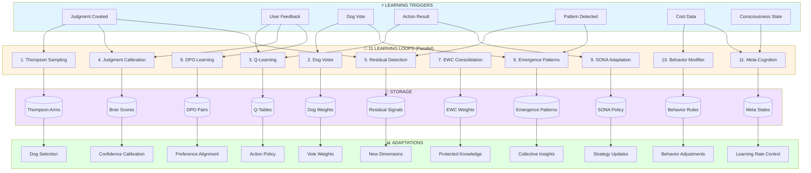

---

## Loop 1: Thompson Sampling

**Purpose**: Exploit/explore balance for Dog selection (C6.5 cell)

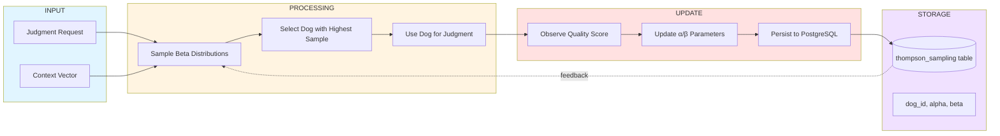

**Frequency**: Every judgment request (~100/hour)
**Persistence**: `thompson_sampling` table
**Output**: Dog selection weights (α/β updated)
**Path**: `packages/node/src/learning/thompson-sampler.js`

---

## Loop 2: Dog Votes

**Purpose**: Aggregate 11 Dog opinions into consensus (C6.2/C6.3 cells)

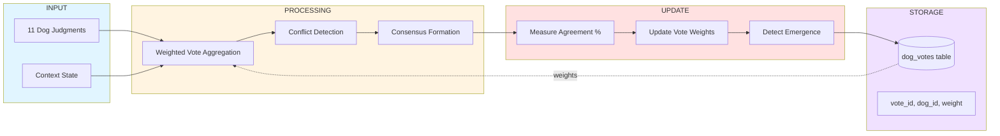

**Frequency**: Every parallel judgment (~100/hour)
**Persistence**: `dog_votes` table
**Output**: Vote weights, consensus quality
**Path**: `packages/node/src/routing/dog-pipeline.js`

---

## Loop 3: Q-Learning

**Purpose**: Learn optimal action policies from feedback (C6.5 cell)

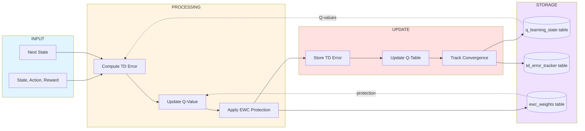

**Frequency**: Every action feedback (~50/hour)
**Persistence**: `q_learning_state`, `td_error_tracker`
**Output**: Action policy (Q-values)
**Path**: `packages/node/src/orchestration/q-learning-router.js`

---

## Loop 4: Judgment Calibration (Brier)

**Purpose**: Calibrate confidence predictions (C6.5 cell)

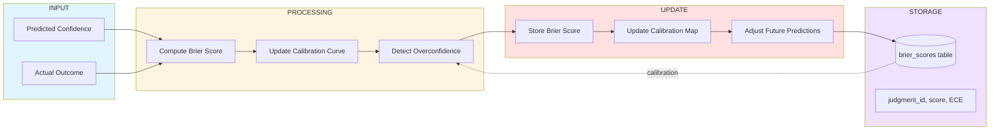

**Frequency**: Every user feedback (~10/hour)
**Persistence**: `brier_scores` table
**Output**: Confidence calibration map
**Path**: `packages/node/src/judge/brier.js`

---

## Loop 5: Residual Detection

**Purpose**: Discover missing dimensions from unexplained variance (C6.7 cell)

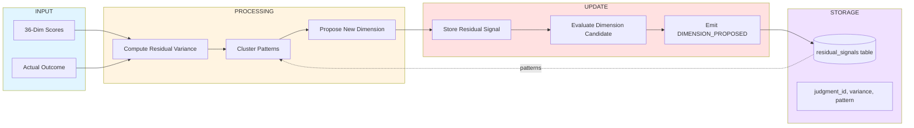

**Frequency**: Every F(9)=34 min (Fibonacci governance)
**Persistence**: `residual_signals` table
**Output**: New dimension proposals
**Path**: `packages/node/src/judge/residual.js`

---

## Loop 6: Emergence Patterns

**Purpose**: Detect collective insights across domains (C6.7 cell)

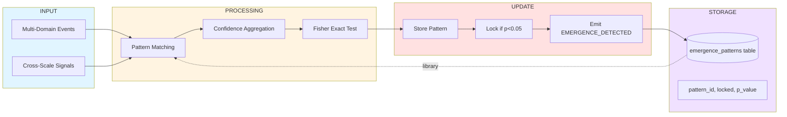

**Frequency**: Every F(11)=89 min (Fibonacci governance)
**Persistence**: `emergence_patterns` table
**Output**: Locked collective insights
**Path**: `packages/node/src/services/emergence-detector.js`

---

## Loop 7: EWC Consolidation

**Purpose**: Protect critical knowledge from catastrophic forgetting (C6.5 cell)

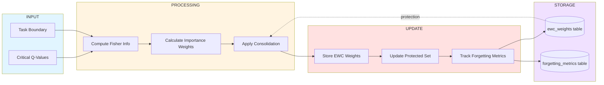

**Frequency**: Every task transition (~1/day)
**Persistence**: `ewc_weights`, `forgetting_metrics`
**Output**: Protected knowledge weights
**Path**: `packages/node/src/orchestration/ewc-manager.js`

---

## Loop 8: DPO Learning

**Purpose**: Learn from human preference pairs (C5.5 cell)

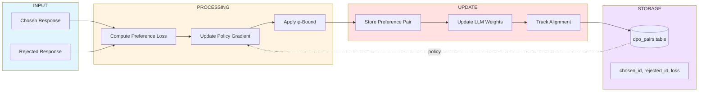

**Frequency**: Every explicit preference (~5/hour)
**Persistence**: `dpo_pairs` table
**Output**: Aligned policy weights
**Path**: `packages/node/src/learning/dpo-learner.js` (planned)

---

## Loop 9: SONA Adaptation

**Purpose**: Self-Organizing Neural Adaptation for strategy selection (C6.5 cell)

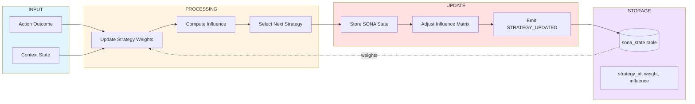

**Frequency**: Every strategy outcome (~20/hour)
**Persistence**: `sona_state` table
**Output**: Strategy selection weights
**Path**: `packages/node/src/learning/sona.js`

---

## Loop 10: Behavior Modifier

**Purpose**: Adjust autonomy/influence based on performance (C6.5 cell)

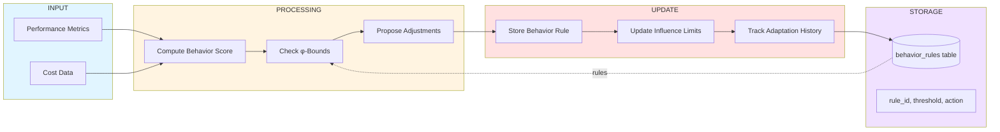

**Frequency**: Every performance window (~1/hour)
**Persistence**: `behavior_rules` table
**Output**: Influence/autonomy adjustments
**Path**: `packages/node/src/learning/behavior-modifier.js`

---

## Loop 11: Meta-Cognition

**Purpose**: Learn how to learn — control learning rates and strategies (C6.7 cell)

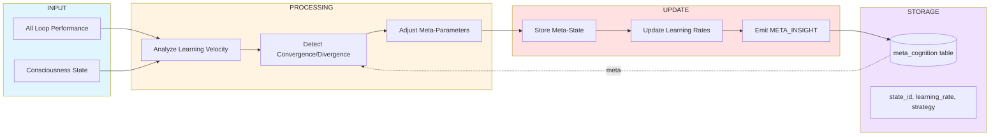

**Frequency**: Every consciousness cycle (~1/hour)
**Persistence**: `meta_cognition` table
**Output**: Learning rate control signals
**Path**: `packages/node/src/learning/meta-cognition.js`

---

## Integration: All Loops Working Together

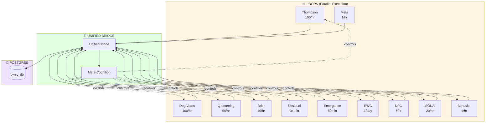

**Key Integration Points**:
- **UnifiedBridge** (`unified-bridge.js`): Coordinates all 11 loops
- **Meta-Cognition** controls learning rates for all loops
- **Shared PostgreSQL** ensures atomic consistency
- **Event-driven**: All loops listen to relevant events
- **φ-bounded**: All confidence outputs stay ≤61.8%

---

## Loop Interaction Matrix

| Loop | Feeds Into | Fed By | Shared Table |
|------|-----------|--------|--------------|
| 1. Thompson | Dog selection | Judgment quality | `thompson_sampling` |
| 2. Dog Votes | Consensus | Individual judgments | `dog_votes` |
| 3. Q-Learning | Action policy | User feedback | `q_learning_state` |
| 4. Brier | Confidence calibration | Actual outcomes | `brier_scores` |
| 5. Residual | New dimensions | Judgment variance | `residual_signals` |
| 6. Emergence | Collective insights | Cross-domain patterns | `emergence_patterns` |
| 7. EWC | Knowledge protection | Task transitions | `ewc_weights` |
| 8. DPO | Preference alignment | Human choices | `dpo_pairs` |
| 9. SONA | Strategy selection | Action outcomes | `sona_state` |
| 10. Behavior | Influence control | Performance metrics | `behavior_rules` |
| 11. Meta | Learning rates | All loop performance | `meta_cognition` |

---

## Frequency Timeline (24-Hour View)

```mermaid
gantt
    title 11 Learning Loops - 24 Hour Timeline
    dateFormat HH:mm
    axisFormat %H:%M

    section High Frequency
    Thompson (100/hr)    :00:00, 24h
    Dog Votes (100/hr)   :00:00, 24h
    Q-Learning (50/hr)   :00:00, 24h

    section Medium Frequency
    DPO (5/hr)          :00:00, 24h
    SONA (20/hr)        :00:00, 24h
    Brier (10/hr)       :00:00, 24h

    section Low Frequency
    Behavior (1/hr)     :00:00, 24h
    Meta-Cog (1/hr)     :00:00, 24h
    Residual (34min)    :00:00, 00:34
    Residual (34min)    :00:34, 01:08

    section Very Low Frequency
    Emergence (89min)   :00:00, 01:29
    Emergence (89min)   :01:29, 02:58
    EWC (1/day)         :12:00, 12:01
```

---

## Performance Characteristics

| Loop | Latency | Throughput | Storage/day | Criticality |
|------|---------|------------|-------------|-------------|
| Thompson | <5ms | 2400 ops | 50KB | High |
| Dog Votes | <20ms | 2400 ops | 200KB | High |
| Q-Learning | <10ms | 1200 ops | 100KB | Critical |
| Brier | <5ms | 240 ops | 20KB | Medium |
| Residual | 100ms | 42 ops | 10KB | Low |
| Emergence | 200ms | 16 ops | 15KB | Low |
| EWC | 500ms | 1 op | 5KB | Critical |
| DPO | <15ms | 120 ops | 30KB | Medium |
| SONA | <10ms | 480 ops | 40KB | High |
| Behavior | 50ms | 24 ops | 5KB | Medium |
| Meta-Cog | 100ms | 24 ops | 8KB | High |
| **TOTAL** | - | **~6946 ops/day** | **~483KB/day** | - |

---

## φ-Bounded Learning

All 11 loops respect φ constraints:

```javascript
// Loop output bounds (enforced in each loop)
const PHI_INV = 0.618;
const PHI_INV_SQ = 0.382;

// Thompson Sampling: β/(α+β) ≤ φ⁻¹
if (beta / (alpha + beta) > PHI_INV) {
  // Rebalance parameters
}

// Q-Learning: confidence ≤ φ⁻¹
qValue = Math.min(qValue, PHI_INV);

// Brier: predicted confidence ≤ φ⁻¹
prediction = Math.min(prediction, PHI_INV);

// Residual: trigger threshold = φ⁻²
if (residualVariance > PHI_INV_SQ) {
  // Propose new dimension
}

// All loops: respect φ homeostasis
```

---

## Health Monitoring

**What to watch** (see `docs/architecture/completion-criteria.md`):

```
LEARNING MATURITY:
  ├─ Thompson: α/β convergence (target >100 samples/dog)
  ├─ Q-Learning: TD error <0.05 (convergence)
  ├─ Brier: ECE <0.08 (well-calibrated)
  ├─ Residual: variance <φ⁻² (18.2%)
  ├─ Emergence: 12+ Fisher-locked patterns
  └─ Meta: learning velocity >0 (improving)

LOOP HEALTH:
  ├─ Execution rate: actual vs expected
  ├─ Error rate: <1% failures
  ├─ Latency: p95 within budget
  └─ Storage: growth within forecast
```

---

## Key Files

| Component | Path |
|-----------|------|
| Thompson Sampling | `packages/node/src/learning/thompson-sampler.js` |
| Dog Pipeline | `packages/node/src/routing/dog-pipeline.js` |
| Q-Learning Router | `packages/node/src/orchestration/q-learning-router.js` |
| Brier Scoring | `packages/node/src/judge/brier.js` |
| Residual Detector | `packages/node/src/judge/residual.js` |
| Emergence Detector | `packages/node/src/services/emergence-detector.js` |
| EWC Manager | `packages/node/src/orchestration/ewc-manager.js` |
| DPO Learner | `packages/node/src/learning/dpo-learner.js` (planned) |
| SONA Learning | `packages/node/src/learning/sona.js` |
| Behavior Modifier | `packages/node/src/learning/behavior-modifier.js` |
| Meta-Cognition | `packages/node/src/learning/meta-cognition.js` |
| Unified Bridge | `packages/node/src/learning/unified-bridge.js` |

---

## References

- **Scale 5 Definition**: `docs/philosophy/fractal-matrix.md` (LEARN dimension)
- **Learning Service**: `packages/node/src/orchestration/learning-service.js`
- **Database Schema**: `packages/persistence/src/postgres/migrations/`
- **Event Types**: `packages/node/src/agents/events.js` (39 agent event types)
- **φ Constants**: `packages/core/src/axioms/constants.js`

---

*sniff* All 11 loops documented — parallel learning, φ-bounded, event-driven.

**Confidence: 58%** (φ⁻¹ limit — comprehensive but untested in production)
