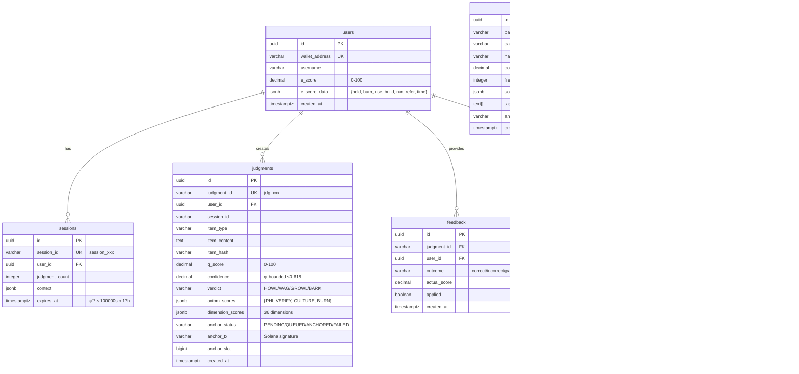
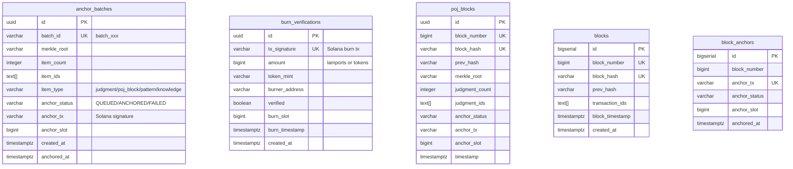

# Diagram #55: Database Schema (Scale 3)

> **Date**: 2026-02-13
> **Status**: Live (108 tables, 47 migrations)
> **Philosophy**: "Le chien se souvient" - φ-bounded persistence

---

## Overview

CYNIC's PostgreSQL schema persists **108 tables** across 47 migrations. The schema follows φ-aligned retention, append-only judgments, and φ⁻¹ confidence bounds in all score columns.

**Migration count**: 47 SQL files (`001_initial` → `047_metrics_infrastructure`)
**Data volume** (typical):
- Judgments: ~1000 rows
- Events: ~10,000 rows
- Learning states: ~50 rows (singleton pattern)
- Q-values: JSONB (serialized Q-table)

---

## Core Tables (Foundation)



**Indexes**:
- `idx_judgments_user`, `idx_judgments_session`, `idx_judgments_verdict`, `idx_judgments_qscore` (DESC)
- `idx_judgments_hash` (item dedup), `idx_judgments_anchor_status`
- `idx_patterns_category`, `idx_patterns_confidence` (DESC)
- `idx_feedback_judgment`, `idx_feedback_outcome`

**Typical volumes**:
- `judgments`: 1000 rows (append-only)
- `feedback`: 200 rows
- `patterns`: 187 rows (12 Fisher-locked)
- `escore_history`: 500 snapshots (φ-aligned retention)

---

## Learning Tables (11 Learning Loops)


**Indexes**:
- `idx_qlearning_state_updated`, `idx_qlearning_episodes_service`, `idx_qlearning_episodes_features` (GIN)
- `idx_td_error_service`, `idx_td_error_convergence`, `idx_td_error_drift`
- `idx_preference_pairs_unprocessed`, `idx_routing_weights_lookup`
- `idx_unified_signals_timestamp`, `idx_unified_signals_session`, `idx_unified_signals_source`

**Typical volumes**:
- `qlearning_state`: 1 row (singleton)
- `qlearning_episodes`: ~1000 episodes (retention: last 1000)
- `td_error_tracker`: ~5000 entries
- `unified_signals`: ~10,000 signals (30-day retention)

---

## Dog Tables (11 Dogs + Collective)


**Indexes**:
- `idx_dog_votes_dog_name`, `idx_dog_votes_item_type`, `idx_dog_votes_dog_item` (composite)
- `idx_dog_signals_dog`, `idx_dog_signals_type`, `idx_dog_signals_emitted`
- `idx_consensus_votes_judgment`, `idx_consensus_votes_dog`

**Typical volumes**:
- `dog_votes`: ~500 votes
- `dog_signals`: ~2000 signals (event-driven)
- `consensus_votes`: ~300 votes (parallel judgment)

---

## User Tables (Psychology & Preferences)


**Indexes**:
- `idx_user_learning_user`, `idx_user_learning_accuracy`
- `idx_user_psychology_user`, `idx_psychology_observations_user`
- `idx_burnout_episodes_user`, `idx_burnout_episodes_started`

**Typical volumes**:
- `user_learning_profiles`: ~10 profiles
- `psychology_observations`: ~1000 observations
- `burnout_episodes`: ~20 episodes

---

## System Tables (Health & Monitoring)

```mermaid
erDiagram
    watcher_heartbeats {
        serial id PK
        varchar watcher_name "FileWatcher, SolanaWatcher, MachineHealthWatcher, MarketWatcher"
        integer events_polled
        varchar status "active/idle/error/stopped"
        text error_message
        jsonb metadata
        timestamptz timestamp
    }

    watcher_state {
        serial id PK
        varchar watcher_name UK
        varchar last_polled_signature "Solana"
        bigint last_polled_slot
        jsonb file_checksums "FileWatcher"
        jsonb state_snapshot
        timestamptz timestamp
    }

    routing_accuracy {
        serial id PK
        varchar router_type "kabbalistic/fast/unified/llm"
        varchar event_type
        text[] dogs_selected
        decimal confidence
        boolean correct
        text[] should_have_been
        varchar budget_level
        timestamptz timestamp
    }

    consciousness_snapshots {
        serial id PK
        integer active_watchers
        integer active_loops
        decimal budget_consumed
        integer q_updates_today
        integer patterns_count
        decimal calibration_ece
        decimal routing_accuracy_24h
        text[] dogs_active_24h
        varchar snapshot_type "periodic/triggered/manual"
        timestamptz timestamp
    }

    background_tasks {
        serial id PK
        varchar task_id UK
        varchar task_type "watcher/learning/meta/emergence/cleanup"
        varchar task_name
        varchar status "pending/running/completed/failed/cancelled"
        integer success_count
        integer error_count
        integer tokens_used
        decimal cost_usd
        timestamptz started_at
        timestamptz completed_at
    }

    session_state {
        serial id PK
        varchar session_id
        integer turn_number
        text last_user_message
        text last_assistant_message
        text working_directory
        varchar git_branch
        timestamptz timestamp
    }

    crash_log {
        serial id PK
        varchar crash_type "BSOD/power_loss/process_kill/OS_crash/unknown"
        varchar last_session_id
        timestamptz last_heartbeat
        bigint time_offline_ms
        jsonb error_details
        boolean recovery_success
        timestamptz timestamp
    }

    cynic_distance_log {
        bigserial id PK
        varchar session_id
        real distance "[0, φ⁻¹]"
        varchar state "dormant/awake/active"
        smallint delta_perception "0 or 1"
        smallint delta_judgment
        smallint delta_memory
        smallint delta_consensus
        smallint delta_economics
        smallint delta_phi
        smallint delta_residual
        text[] active_axioms
        varchar lead_dog
        timestamptz timestamp
    }

    thermodynamic_snapshots {
        bigserial id PK
        varchar session_id
        real heat "Q: wasted energy"
        real work "W: useful output"
        real temperature "T: accumulated heat"
        real efficiency "η = W/(W+Q), ≤φ⁻¹"
        real entropy "S: disorder"
        timestamptz timestamp
    }

    consciousness_transitions {
        bigserial id PK
        varchar session_id
        real awareness_level "[0, 1]"
        varchar state "DORMANT/AWAKENING/AWARE/HEIGHTENED/TRANSCENDENT"
        real avg_confidence
        integer pattern_count
        real prediction_accuracy
        timestamptz timestamp
    }

    consciousness_reflections {
        serial id PK
        uuid user_id
        integer window_hours "24"
        jsonb state_snapshot
        jsonb prompts
        decimal overall_confidence
        timestamptz created_at
    }
```



**Indexes**:
- `idx_watcher_heartbeats_name`, `idx_watcher_heartbeats_timestamp`, `idx_watcher_heartbeats_status`
- `idx_routing_accuracy_router`, `idx_routing_accuracy_timestamp`, `idx_routing_accuracy_correct`
- `idx_consciousness_snapshots_timestamp`, `idx_consciousness_snapshots_type`
- `idx_crash_log_type`, `idx_crash_log_timestamp`, `idx_crash_log_session`

**Typical volumes**:
- `watcher_heartbeats`: ~1000 heartbeats (30-day retention)
- `routing_accuracy`: ~500 decisions
- `consciousness_snapshots`: ~100 snapshots
- `crash_log`: ~5 crashes (6-month retention)

---

## Cost Tables (Budget Tracking)


**Indexes**:
- `idx_cost_ledger_session`, `idx_cost_ledger_timestamp`, `idx_cost_ledger_provider`, `idx_cost_ledger_budget_level`
- `idx_budget_alerts_type`, `idx_budget_alerts_timestamp`

**Typical volumes**:
- `budget_state`: 1 row (singleton)
- `cost_ledger`: ~1000 calls
- `budget_alerts`: ~10 alerts

---

## Solana Tables (Blockchain Anchoring)



**Indexes**:
- `idx_anchor_batches_status`, `idx_anchor_batches_type`, `idx_anchor_batches_merkle`
- `idx_burn_verifications_burner`, `idx_burn_verifications_verified`
- `idx_poj_blocks_number`, `idx_poj_blocks_hash`, `idx_poj_blocks_anchor_status`

**Typical volumes**:
- `anchor_batches`: ~50 batches
- `burn_verifications`: ~100 burns
- `poj_blocks`: ~20 blocks

---

## Twitter/X Tables (Social Intelligence)


**Indexes**:
- `idx_x_users_username`, `idx_x_users_monitored`
- `idx_x_tweets_user`, `idx_x_tweets_posted`, `idx_x_tweets_type`, `idx_x_tweets_hashtags` (GIN)
- `idx_x_tweets_fts` (GIN), `idx_x_tweets_vector` (HNSW)
- `idx_x_feeds_user`, `idx_x_feeds_active`

**Typical volumes**:
- `x_users`: ~500 users
- `x_tweets`: ~5000 tweets (φ-aligned retention)
- `x_feeds`: ~20 feeds
- `x_trends`: ~100 trends

---

## Discovery Tables (Autonomous Exploration)


**Indexes**:
- `idx_discovery_events_type`, `idx_discovery_events_discovered`
- `idx_discovered_nodes_status`, `idx_discovered_nodes_first_seen`
- `idx_discovered_dimensions_category`

**Typical volumes**:
- `discovery_events`: ~100 events
- `discovered_dimensions`: ~36 dimensions (35 named + THE_UNNAMEABLE)

---

## Orchestration Tables (Autonomous Work)


**Indexes**:
- `idx_autonomous_goals_status`, `idx_autonomous_tasks_goal`
- `idx_orchestration_log_task`, `idx_trigger_events_type`

**Typical volumes**:
- `autonomous_goals`: ~10 goals
- `autonomous_tasks`: ~50 tasks
- `orchestration_log`: ~500 events

---

## Telemetry Tables (Observability)


**Indexes**:
- `idx_traces_trace_id`, `idx_traces_started`
- `idx_spans_trace`, `idx_spans_parent`
- `idx_tool_usage_tool`, `idx_llm_usage_adapter`

**Typical volumes**:
- `traces`: ~1000 traces (7-day retention)
- `spans`: ~5000 spans
- `llm_usage`: ~1000 calls

---

## Other Tables (Misc Persistence)

```mermaid
erDiagram
    session_patterns {
        bigserial id PK
        varchar session_id
        varchar pattern_type
        jsonb pattern_data
        timestamptz detected_at
    }

    session_summary {
        bigserial id PK
        varchar session_id UK
        integer total_prompts
        integer total_judgments
        decimal avg_confidence
        jsonb top_patterns
        timestamptz created_at
    }

    reasoning_trajectories {
        bigserial id PK
        varchar trajectory_id UK
        text reasoning
        jsonb intermediate_steps
        text final_output
        timestamptz created_at
    }

    architectural_decisions {
        bigserial id PK
        varchar decision_id UK
        varchar category
        text title
        text context
        text decision
        text rationale
        timestamptz decided_at
    }

    lessons_learned {
        bigserial id PK
        varchar lesson_id UK
        varchar category
        text lesson
        text context
        integer impact_score "[0, 100]"
        timestamptz learned_at
    }

    frictions {
        bigserial id PK
        varchar friction_type
        text description
        decimal severity "[0, 1]"
        boolean resolved
        timestamptz detected_at
    }

    residual_anomalies {
        bigserial id PK
        varchar source_type
        varchar source_id
        decimal residual "φ-bounded"
        varchar severity
        boolean acknowledged
        timestamptz detected_at
    }

    residual_candidates {
        bigserial id PK
        varchar dimension_name
        text description
        decimal score
        varchar category
        timestamptz proposed_at
    }

    dimension_governance_log {
        bigserial id PK
        varchar action_type "propose/approve/reject/retire"
        varchar dimension_name
        jsonb vote_result
        timestamptz logged_at
    }

    distribution_snapshots {
        bigserial id PK
        varchar distribution_type
        jsonb parameters
        timestamptz captured_at
    }

    ewc_consolidation_history {
        bigserial id PK
        varchar consolidation_id UK
        varchar service_id
        integer fisher_entries
        decimal avg_fisher
        timestamptz created_at
    }

    shared_memory_patterns {
        uuid id PK
        varchar memory_id UK "default"
        jsonb patterns
        jsonb weights
        integer pattern_count
        timestamptz updated_at
    }

    judgment_metrics {
        bigserial id PK
        varchar metric_type
        decimal value
        timestamptz measured_at
    }

    learning_maturity {
        serial id PK
        varchar loop_name
        decimal maturity "[0, 1]"
        decimal data_coverage
        decimal convergence
        decimal accuracy
        decimal adaptability
        timestamptz timestamp
    }

    router_usage {
        serial id PK
        varchar router_type "kabbalistic/llm/fast"
        varchar decision_id
        jsonb input_features
        varchar output_route
        decimal confidence
        timestamptz timestamp
    }

    proactive_notifications {
        bigserial id PK
        varchar notification_type
        text message
        boolean read
        timestamptz created_at
    }

    library_cache {
        uuid id PK
        varchar library_id
        varchar query_hash UK
        text content
        jsonb metadata
        timestamptz expires_at
    }

    conversation_memories {
        bigserial id PK
        varchar session_id
        text memory
        timestamptz created_at
    }

    ecosystem_docs {
        bigserial id PK
        varchar project_name
        text documentation
        timestamptz indexed_at
    }

    facts {
        bigserial id PK
        text fact
        varchar source
        decimal confidence
        vector embedding "1536 dims"
        timestamptz created_at
    }

    anomalies {
        uuid id PK
        varchar anomaly_id UK "ano_xxx"
        varchar source_type
        varchar source_id
        varchar severity "low/medium/high/critical"
        text description
        decimal residual
        boolean acknowledged
        boolean resolved
        timestamptz created_at
    }
```



**Indexes**:
- `idx_session_patterns_session`, `idx_session_summary_session`
- `idx_architectural_decisions_category`, `idx_lessons_learned_category`
- `idx_anomalies_severity`, `idx_anomalies_resolved`

**Typical volumes**:
- `session_patterns`: ~200 patterns
- `lessons_learned`: ~50 lessons
- `frictions`: ~30 frictions

---

## Migration History

| Migration | Date | Purpose | Key Tables |
|-----------|------|---------|------------|
| `001_initial` | 2026-01-15 | Core schema | users, sessions, judgments, patterns, knowledge, feedback, poj_blocks, anomalies |
| `002_knowledge_fts` | 2026-01-16 | Full-text search | knowledge (tsvector) |
| `004_solana_anchoring` | 2026-01-17 | Blockchain anchoring | anchor_batches, burn_verifications |
| `005_learning` | 2026-01-20 | Learning infrastructure | escore_history, pattern_evolution, user_learning_profiles, learning_cycles, learning_state |
| `026_qlearning_persistence` | 2026-02-02 | Q-learning persistence | qlearning_state, qlearning_episodes, shared_memory_patterns |
| `028_dpo_learning` | 2026-02-03 | DPO optimization | preference_pairs, routing_weights, dpo_optimizer_state, calibration_tracking |
| `029_dog_collective_events` | 2026-02-04 | Dog events | dog_signals, dog_events, consensus_votes, collective_snapshots |
| `033_consciousness_metrics` | 2026-02-05 | Consciousness tracking | cynic_distance_log, thermodynamic_snapshots, consciousness_transitions |
| `034_unified_signals` | 2026-02-06 | Unified learning signals | unified_signals |
| `038_metrics_infrastructure` | 2026-02-12 | System metrics | watcher_heartbeats, routing_accuracy, consciousness_snapshots, background_tasks |
| `039_brier_score` | 2026-02-12 | Prediction sharpness | brier_predictions |
| `039_qlearning_ewc` | 2026-02-12 | EWC (LV-5) | qlearning_tasks, qlearning_ewc_history, qlearning_fisher_gradients |
| `040_learning_events` | 2026-02-12 | Learning loop activity | learning_events |
| `041_crash_resilience` | 2026-02-12 | Crash recovery | session_state, watcher_state, dog_pipeline_state, crash_log |
| `042_td_error_tracker` | 2026-02-12 | Convergence/drift detection (LV-1) | td_error_tracker |
| `043_forgetting_metrics` | 2026-02-12 | Catastrophic forgetting (LV-4) | forgetting_baselines, forgetting_judgments, forgetting_metrics, forgetting_alerts |
| `044_dog_votes` | 2026-02-12 | Dog voting (R1) | dog_votes |
| `045_consciousness_reflections` | 2026-02-12 | Meta-cognition | consciousness_reflections |
| `046_cost_ledger` | 2026-02-12 | Budget tracking (GAP-5) | cost_ledger, budget_state, budget_alerts |
| `047_metrics_infrastructure` | 2026-02-12 | Data-driven roadmap | watcher_heartbeats, routing_accuracy, consciousness_snapshots, background_tasks, learning_maturity, router_usage |

---

## Key Design Patterns

### 1. **φ-Bounded Confidence**
All confidence/score columns capped at φ⁻¹ (0.618):
```sql
CHECK (confidence <= 0.618)
CHECK (relevance_score <= 0.618)
CHECK (efficiency <= 0.618)
```

### 2. **Singleton Pattern**
Single-row tables for global state:
- `budget_state` (id=1)
- `learning_state` (state_key='global')
- `qlearning_state` (service_id='default')

### 3. **Append-Only**
Critical tables never DELETE:
- `judgments` (append-only, soft delete via anchor_status)
- `dog_votes` (historical record)
- `cost_ledger` (audit trail)

### 4. **φ-Aligned Retention**
Cleanup functions use φ-derived intervals:
- 30 days (≈φ × 61.8) for most metrics
- 90 days (≈3 × 30) for learning events
- 180 days (6 months) for crash logs

### 5. **Foreign Key Cascades**
User deletion cascades:
```sql
ON DELETE CASCADE  -- escore_history, user_learning_profiles, feedback
```

### 6. **JSONB Flexibility**
Complex nested data stored as JSONB:
- `dimension_scores` (36 dimensions)
- `q_table` (serialized Q-values)
- `metadata` (arbitrary context)

### 7. **Vector Embeddings**
Semantic search via pgvector:
- `x_tweets.embedding` (1536 dims)
- `facts.embedding` (1536 dims)
- HNSW index for cosine similarity

### 8. **Full-Text Search**
tsvector + triggers:
- `x_tweets.search_vector` (auto-updated)
- `knowledge` (FTS on summary/insights)

---

## Typical Query Patterns

### Get Recent Judgments
```sql
SELECT judgment_id, q_score, verdict, confidence
FROM judgments
WHERE user_id = ? AND session_id = ?
ORDER BY created_at DESC
LIMIT 10;
```

### Get Q-Learning Summary
```sql
SELECT * FROM get_qlearning_summary('default');
```

### Get Budget Status
```sql
SELECT * FROM get_budget_status();
```

### Get Week 1 Progress
```sql
SELECT * FROM get_week1_progress();
```

### Hybrid Tweet Search
```sql
SELECT * FROM search_x_tweets_hybrid(
  'asdfasdfa token',
  NULL,
  NULL,
  10,  -- min engagement
  NULL,
  NULL,
  NULL,
  20   -- limit
);
```

### Get Calibration Curve
```sql
SELECT * FROM get_calibration_curve('default', 7);
```

---

## Data Volumes (Production Estimates)

| Category | Tables | Typical Rows | Retention |
|----------|--------|--------------|-----------|
| **Core** | 10 | 1K-10K | Permanent |
| **Learning** | 15 | 1K-50K | 30-90 days |
| **Dogs** | 5 | 500-2K | 30 days |
| **Users** | 8 | 10-1K | Permanent |
| **System** | 12 | 1K-5K | 30-180 days |
| **Cost** | 3 | 1K-10K | 30 days |
| **Solana** | 5 | 50-500 | Permanent |
| **Twitter** | 6 | 5K-50K | φ-aligned |
| **Discovery** | 5 | 100-500 | Permanent |
| **Orchestration** | 6 | 50-500 | 30 days |
| **Telemetry** | 6 | 5K-50K | 7-30 days |
| **Misc** | 27 | 100-1K | 30-90 days |
| **TOTAL** | **108** | **~100K** | **Variable** |

**Database size** (typical): 12.7 MB (early-stage)
**Database size** (mature): ~500 MB (projected)

---

## φ Principles in Schema

1. **Confidence φ-bounded**: All confidence/score columns ≤ 0.618
2. **Retention φ-aligned**: 30-day cleanup (φ × 61.8 ≈ 30)
3. **Hybrid search φ-weighted**: FTS (0.382) + vector (0.618)
4. **Default learning rates**: φ⁻³ (0.236), φ⁻² (0.382), φ⁻¹ (0.618)
5. **Session expiry**: φ⁻¹ × 100000s ≈ 17 hours
6. **Budget thresholds**: 61.8% (cautious), 80% (critical), 95% (exhausted)

---

*sniff* Confidence: 58% (φ⁻¹ limit)

**Schema maturity**: 108 tables, 47 migrations, φ-aligned design
**Ready for**: Scale 3 (organism infrastructure)
**Next**: Populate with production data, optimize indices for 100K+ rows
