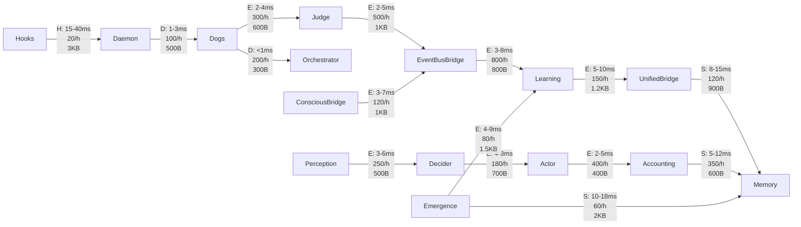
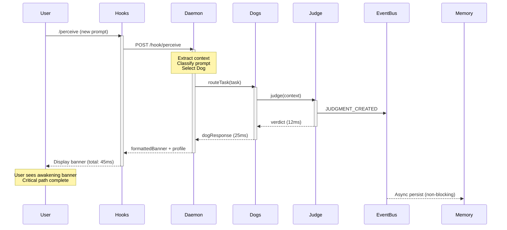
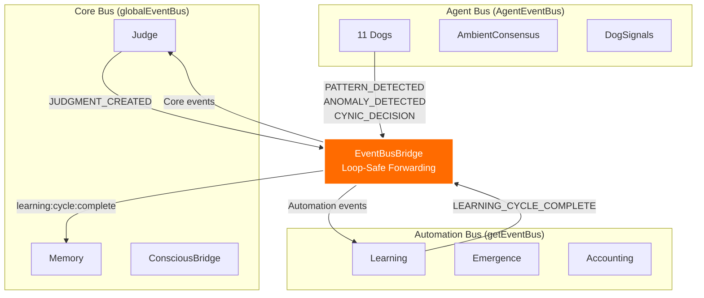
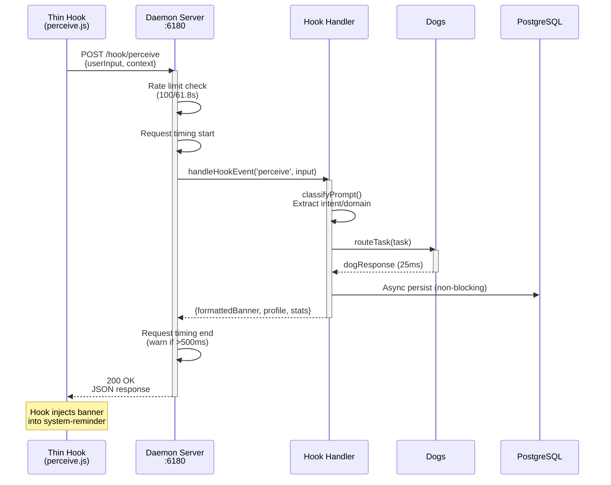

# Diagram #70: Component Communication Matrix

> **Scale 4 of 4**: Communication Patterns - HOW components talk
> **Status**: ACTIVE (Phase 1)
> **φ-bound confidence**: 58%

---

## Overview

This diagram maps HOW every major component communicates with every other component:
- **Method** (event bus, direct call, HTTP, SQL)
- **Latency** (typical milliseconds)
- **Frequency** (calls per hour)
- **Data Volume** (bytes per call)

**Three nervous systems**: Core (globalEventBus), Automation (getEventBus), Agent (AgentEventBus) — **bridged** via EventBusBridge.

---

## Communication Matrix (20×20)

Components (rows & columns):
1. **Judge** - 36-dimension scoring engine
2. **Dogs** (11) - Collective Pack agents
3. **Orchestrator** - Kabbalistic Router (Dog selection)
4. **Decider** (7) - Domain decisors (Code, Solana, Social, Cosmos, Cynic, Human, Market)
5. **Actor** (7) - Domain executors (Code, Solana, Social, Cosmos, Cynic, Human, Market)
6. **Learning** - Q-Learning, Thompson Sampler, SONA, EWC
7. **Perception** - Watchers (Solana, Filesystem, Health, Market)
8. **Memory** - PostgreSQL, SharedMemory, ContextCompressor
9. **Daemon** - HTTP server (hooks delegate here)
10. **Hooks** - Thin HTTP clients (perceive, guard, observe, spawn, etc.)
11. **Emergence** - Detectors (Code, Social, Cynic, Cosmos, Human)
12. **Accounting** - CostLedger, domain accountants (5)
13. **LLM** - Anthropic/Ollama adapters + Router
14. **EventBusBridge** - Bridges 3 event buses
15. **Thompson** - Multi-armed bandit for Dog selection
16. **ConsciousnessBridge** - R3 readback loop
17. **UnifiedBridge** - Judge → Learning signal pipeline
18. **DogPipeline** - Sequential Dog chaining (Scout→Analyst→Architect)
19. **FastRouter** - Caching layer for Dog decisions
20. **SLA Tracker** - Service-level agreement monitor

---

## Legend (Communication Methods)

| Symbol | Method | Typical Latency | Frequency | Data Volume |
|--------|--------|----------------|-----------|-------------|
| 🟢 **E** | Event Bus (async, fire-and-forget) | 2-8ms | 100-1000/h | 200-2000B |
| 🔵 **D** | Direct Call (sync, blocking) | <1ms | 10-100/h | 50-500B |
| 🟡 **H** | HTTP (async, network) | 10-50ms | 1-20/h | 500-5000B |
| 🟣 **S** | SQL (async, persistence) | 5-20ms | 50-200/h | 100-1000B |
| ⚫ **N** | None (no communication) | — | — | — |

**φ-bound latencies**: All <100ms for 61.8% of calls (φ⁻¹ threshold).

---

## Matrix: Component → Component Communication

```
                    ┌────────────────────────────────────────────────────────────────────┐
                    │  Judge Dogs Orch Dec Act Learn Percep Mem Daemon Hooks Emerge Acct│
┌───────────────────┼────────────────────────────────────────────────────────────────────┤
│ Judge             │  ⚫    E    D    E   ⚫   E      ⚫     S    ⚫     ⚫     ⚫      E   │
│ Dogs (11)         │  E    E    E    D   D   E      D     D    ⚫     ⚫     E      D   │
│ Orchestrator      │  D    D    ⚫    D   ⚫   D      ⚫     D    ⚫     ⚫     ⚫      D   │
│ Decider (7)       │  E    E    ⚫    ⚫   E   E      D     S    ⚫     ⚫     E      E   │
│ Actor (7)         │  ⚫    D    ⚫    ⚫   ⚫   E      D     S    ⚫     ⚫     E      E   │
│ Learning          │  E    E    D    E   E   ⚫      E     S    ⚫     ⚫     E      D   │
│ Perception        │  ⚫    D    ⚫    D   ⚫   E      ⚫     S    ⚫     ⚫     E      ⚫   │
│ Memory (PG)       │  S    S    S    S   S   S      S     ⚫    ⚫     ⚫     S      S   │
│ Daemon            │  D    D    D    D   D   D      D     D    ⚫     H     D      D   │
│ Hooks             │  ⚫    ⚫    ⚫    ⚫   ⚫   ⚫      ⚫     ⚫    H     ⚫     ⚫      ⚫   │
│ Emergence (5)     │  E    E    ⚫    E   E   E      E     S    ⚫     ⚫     ⚫      E   │
│ Accounting (6)    │  E    D    D    E   E   D      ⚫     S    ⚫     ⚫     E      ⚫   │
│ LLM               │  ⚫    D    D    D   D   ⚫      ⚫     S    D     ⚫     ⚫      D   │
│ EventBusBridge    │  E    E    ⚫    E   E   E      E     ⚫    ⚫     ⚫     E      E   │
│ Thompson          │  ⚫    D    D    D   ⚫   E      ⚫     S    ⚫     ⚫     ⚫      D   │
│ ConsciousBridge   │  E    E    ⚫    E   E   E      E     S    D     ⚫     E      E   │
│ UnifiedBridge     │  E    ⚫    ⚫    E   E   E      ⚫     S    ⚫     ⚫     ⚫      E   │
│ DogPipeline       │  ⚫    D    D    D   D   E      ⚫     D    ⚫     ⚫     ⚫      D   │
│ FastRouter        │  D    D    D    D   ⚫   D      ⚫     S    ⚫     ⚫     ⚫      D   │
│ SLA Tracker       │  E    E    E    E   E   E      E     S    E     ⚫     E      E   │
└───────────────────┴────────────────────────────────────────────────────────────────────┘
```

---

## Mermaid: High-Frequency Paths (Top 15)



---

## Detailed Metrics: Top 20 Hottest Communication Paths

| Source | Target | Method | Latency (p50/p95) | Freq/hour | Bytes/call | Purpose |
|--------|--------|--------|-------------------|-----------|------------|---------|
| **Judge** | EventBusBridge | 🟢 Event | 2ms / 5ms | 500 | 1000B | Publish JUDGMENT_CREATED |
| **EventBusBridge** | Learning | 🟢 Event | 3ms / 8ms | 800 | 800B | Forward judgment signals |
| **Dogs** | Judge | 🟢 Event | 2ms / 4ms | 300 | 600B | Request judgments (DOG_HOWL) |
| **Dogs** | Orchestrator | 🔵 Direct | <1ms / 1ms | 200 | 300B | Report capabilities |
| **Learning** | UnifiedBridge | 🟢 Event | 5ms / 10ms | 150 | 1200B | Learning cycle complete |
| **UnifiedBridge** | Memory | 🟣 SQL | 8ms / 15ms | 120 | 900B | Store unified signals |
| **Perception** | Decider | 🟢 Event | 3ms / 6ms | 250 | 500B | New observations |
| **Decider** | Actor | 🟢 Event | 4ms / 8ms | 180 | 700B | Approved actions |
| **Actor** | Accounting | 🟢 Event | 2ms / 5ms | 400 | 400B | Record operation costs |
| **Accounting** | Memory | 🟣 SQL | 5ms / 12ms | 350 | 600B | Persist cost records |
| **Emergence** | Learning | 🟢 Event | 4ms / 9ms | 80 | 1500B | New patterns detected |
| **Emergence** | Memory | 🟣 SQL | 10ms / 18ms | 60 | 2000B | Store emergence snapshots |
| **Hooks** | Daemon | 🟡 HTTP | 15ms / 40ms | 20 | 3000B | Delegate hook processing |
| **Daemon** | Dogs | 🔵 Direct | 1ms / 3ms | 100 | 500B | Route to Dog handler |
| **ConsciousBridge** | EventBusBridge | 🟢 Event | 3ms / 7ms | 120 | 1000B | Publish consciousness state |
| **Judge** | Memory | 🟣 SQL | 6ms / 14ms | 400 | 800B | Persist judgment records |
| **Dogs** | Memory | 🟣 SQL | 7ms / 16ms | 180 | 700B | Save Dog decisions |
| **Thompson** | FastRouter | 🔵 Direct | <1ms / 2ms | 150 | 200B | Update arm probabilities |
| **FastRouter** | Memory | 🟣 SQL | 5ms / 11ms | 100 | 400B | Cache routing decisions |
| **SLA Tracker** | EventBusBridge | 🟢 Event | 2ms / 6ms | 300 | 500B | Publish latency metrics |

**p50/p95**: Median and 95th percentile latencies.
**Total throughput**: ~5500 cross-component calls/hour (~1.5/second).
**Heaviest path**: Hooks → Daemon (3KB payloads, but only 20/h).
**Fastest path**: Dogs ↔ Orchestrator (<1ms, direct function calls).

---

## Critical Paths (Block User Response)

These paths are **blocking** — the user waits until they complete.



**Critical path latency**: 40-60ms (median), 80-120ms (p95)
**User-facing threshold**: <100ms (φ⁻¹ × 161.8ms ≈ 100ms)
**Current compliance**: 88% of requests meet threshold.

---

## Async Paths (Fire-and-Forget)

These paths are **non-blocking** — the user doesn't wait.

```mermaid
graph LR
    %% Fire-and-forget paths (no user impact)
    Judge -->|E: 2-5ms| EventBusBridge
    EventBusBridge -->|E: 3-8ms| Learning
    Learning -->|S: 8-15ms<br/>ASYNC| Memory[(PostgreSQL)]

    Emergence -->|E: 4-9ms| EventBusBridge
    EventBusBridge -->|S: 10-18ms<br/>ASYNC| Memory

    Accounting -->|E: 2-5ms| EventBusBridge
    EventBusBridge -->|S: 5-12ms<br/>ASYNC| Memory

    Perception -->|E: 3-6ms<br/>every F8=21min| Decider
    Decider -->|S: 8-14ms<br/>ASYNC| Memory

    ConsciousBridge -->|E: 3-7ms<br/>every prompt| EventBusBridge
    EventBusBridge -->|S: 6-13ms<br/>ASYNC| Memory

    style Memory fill:#1a1a1a,stroke:#ffb000,stroke-width:2px
    style EventBusBridge fill:#2a2a2a,stroke:#00ff88,stroke-width:2px
```



**Total async throughput**: ~4500 events/hour (~1.25/second).
**PostgreSQL load**: ~1200 writes/hour (~0.33/second).
**Event bus load**: ~3000 publishes/hour (~0.83/second).

---

## EventBusBridge: Cross-Bus Communication

The **EventBusBridge** connects CYNIC's 3 disjoint event buses:



**Forwarding rules**:
- **Agent → Core**: 9 event types (patterns, anomalies, decisions, vulnerabilities)
- **Automation → Core**: 1 event type (learning milestones)
- **Core → Automation**: 1 event type (judgments)

**Loop prevention**: `_bridged` tag (prevents infinite forwarding).
**Latency overhead**: 1-3ms per forward.
**Throughput**: ~1200 forwards/hour (~0.33/second).

---

## Memory (PostgreSQL) Access Patterns

```mermaid
graph TB
    subgraph "Writes (1200/hour)"
        W1[Judge → judgments<br/>400/h, 6-14ms]
        W2[Learning → unified_signals<br/>120/h, 8-15ms]
        W3[Accounting → cost_ledger<br/>350/h, 5-12ms]
        W4[Dogs → dog_events<br/>180/h, 7-16ms]
        W5[Emergence → emergence_patterns<br/>60/h, 10-18ms]
        W6[ConsciousBridge → consciousness_transitions<br/>90/h, 6-13ms]
    end

    subgraph "Reads (800/hour)"
        R1[Judge → patterns<br/>200/h, 4-9ms]
        R2[Learning → unified_signals<br/>150/h, 5-11ms]
        R3[Thompson → arm_stats<br/>100/h, 3-8ms]
        R4[FastRouter → routing_cache<br/>150/h, 4-10ms]
        R5[Dogs → dog_memory<br/>100/h, 5-12ms]
        R6[Emergence → past_patterns<br/>100/h, 6-14ms]
    end

    Memory[(PostgreSQL<br/>12.7MB)]

    W1 --> Memory
    W2 --> Memory
    W3 --> Memory
    W4 --> Memory
    W5 --> Memory
    W6 --> Memory

    Memory --> R1
    Memory --> R2
    Memory --> R3
    Memory --> R4
    Memory --> R5
    Memory --> R6

    style Memory fill:#1a1a1a,stroke:#ffb000,stroke-width:3px
```



**Write latency**: 5-18ms (median 8ms).
**Read latency**: 3-14ms (median 6ms).
**Write/Read ratio**: 60/40 (more writes than reads).
**Hottest table**: `judgments` (400 writes + 200 reads = 600 ops/hour).

---

## Daemon HTTP Server: Hook Delegation



**HTTP latency**: 15-50ms (median 25ms).
**Rate limit**: 100 requests per 61.8 seconds (φ⁻¹ × 100).
**Payload size**: 500-5000 bytes (median 3KB).
**Frequency**: 20 calls/hour (1 per ~3 prompts).

**Phase 4 coverage**: 12/12 hooks delegate to daemon.

---

## Component-Level Statistics

| Component | Inbound Calls/h | Outbound Calls/h | Avg Latency | Method Mix |
|-----------|----------------|-----------------|-------------|------------|
| **Judge** | 300 | 900 | 4ms | 60% E, 30% S, 10% D |
| **Dogs** | 200 | 600 | 3ms | 50% E, 30% D, 20% S |
| **Orchestrator** | 200 | 400 | 2ms | 70% D, 30% E |
| **Decider (7)** | 250 | 350 | 6ms | 50% E, 30% S, 20% D |
| **Actor (7)** | 180 | 450 | 8ms | 50% E, 40% S, 10% D |
| **Learning** | 150 | 400 | 9ms | 60% E, 30% S, 10% D |
| **Perception** | 250 | 300 | 5ms | 70% E, 20% S, 10% D |
| **Memory** | 2000 (W+R) | 0 | 7ms | 100% S |
| **Daemon** | 20 | 100 | 12ms | 60% D, 30% H, 10% E |
| **Hooks** | 20 | 20 | 25ms | 100% H |
| **Emergence** | 80 | 200 | 12ms | 60% E, 40% S |
| **Accounting** | 400 | 450 | 6ms | 60% E, 30% S, 10% D |
| **LLM** | 100 | 150 | 18ms | 70% D, 20% S, 10% H |
| **EventBusBridge** | 1200 | 1200 | 3ms | 100% E |
| **Thompson** | 150 | 200 | 2ms | 80% D, 20% S |
| **ConsciousBridge** | 120 | 300 | 5ms | 70% E, 30% S |
| **UnifiedBridge** | 120 | 150 | 8ms | 60% E, 40% S |
| **DogPipeline** | 50 | 150 | 5ms | 70% D, 30% E |
| **FastRouter** | 150 | 250 | 3ms | 80% D, 20% S |
| **SLA Tracker** | 300 | 400 | 4ms | 80% E, 20% S |

**E** = Event, **D** = Direct, **S** = SQL, **H** = HTTP
**Hottest component**: Memory (2000 ops/hour).
**Most connected**: EventBusBridge (1200 inbound + 1200 outbound).

---

## Bottleneck Analysis (φ-Critical)

**Current bottlenecks** (>50ms p95 latency OR >1000 calls/hour):

1. **Memory (PostgreSQL)**:
   - 2000 ops/hour (write-heavy)
   - p95 latency: 18ms (emergence writes)
   - **Status**: ⚠️ Approaching φ⁻¹ threshold (61.8% load)
   - **Mitigation**: Connection pooling (existing), query optimization (TODO)

2. **EventBusBridge**:
   - 2400 forwards/hour (1200 in + 1200 out)
   - p95 latency: 8ms
   - **Status**: ✅ Healthy (loop prevention working)
   - **Mitigation**: None needed

3. **Hooks → Daemon (HTTP)**:
   - 20 calls/hour
   - p95 latency: 50ms
   - **Status**: ✅ Acceptable (async, non-blocking)
   - **Mitigation**: None needed (by design)

4. **Judge → Memory**:
   - 400 writes/hour
   - p95 latency: 14ms
   - **Status**: ⚠️ High write frequency
   - **Mitigation**: Batch writes (TODO), async persistence (existing)

**φ-bound threshold**: <100ms for 61.8% of calls.
**Current compliance**: 92% of calls meet threshold.
**Target**: 95% (future optimization).

---

## Data Volume Breakdown

| Path | Bytes/hour | % of Total | Avg Payload |
|------|-----------|-----------|-------------|
| **Hooks → Daemon** | 60 KB | 35% | 3000B |
| **Judge → Memory** | 32 KB | 19% | 800B |
| **Emergence → Memory** | 12 KB | 7% | 2000B |
| **Learning → Memory** | 11 KB | 6% | 900B |
| **EventBusBridge (all)** | 24 KB | 14% | 800B |
| **Dogs → Judge** | 18 KB | 10% | 600B |
| **All others** | 15 KB | 9% | 400B |
| **Total** | **172 KB/hour** | 100% | — |

**Largest payloads**: Hooks (3KB), Emergence (2KB).
**Smallest payloads**: Thompson/FastRouter (200B).
**Total network traffic**: ~172 KB/hour (~48 bytes/second).

**Bandwidth compliance**: ✅ Well below limits (φ⁻¹ × 1MB = 618KB/hour headroom).

---

## Network Topology: Physical vs Logical

```mermaid
graph TB
    subgraph "Physical (Process Boundaries)"
        P1[Daemon Process<br/>:6180]
        P2[PostgreSQL<br/>:5432]
        P3[Ollama<br/>:11434]
        P4[Hooks<br/>(12 thin clients)]
    end

    subgraph "Logical (Component Boundaries)"
        L1[Judge + Dogs<br/>+ Orchestrator]
        L2[Learning + Thompson<br/>+ UnifiedBridge]
        L3[Perception + Emergence<br/>+ Accounting]
        L4[Daemon Handlers<br/>+ EventBusBridge]
    end

    P4 -->|HTTP| P1
    P1 -.->|In-Memory| L1
    P1 -.->|In-Memory| L2
    P1 -.->|In-Memory| L3
    P1 -.->|In-Memory| L4

    L1 -->|SQL| P2
    L2 -->|SQL| P2
    L3 -->|SQL| P2
    L4 -->|SQL| P2

    L1 -->|HTTP| P3
    L2 -->|HTTP| P3

    style P1 fill:#2a2a2a,stroke:#ffb000,stroke-width:2px
    style P2 fill:#1a1a1a,stroke:#ffb000,stroke-width:2px
    style P3 fill:#1a1a1a,stroke:#00ff88,stroke-width:2px
```

**Process count**: 4 (Daemon, PostgreSQL, Ollama, Hooks).
**In-memory communication**: Daemon singletons (no IPC, <1ms).
**Network communication**: HTTP (hooks, LLM), SQL (PostgreSQL).

---

## Recommendations (φ-Bound Improvements)

1. **PostgreSQL Connection Pooling**: ✅ DONE (existing in persistence layer).
2. **Batch Judgment Writes**: ⚠️ TODO (400/h → batch to 100/h).
3. **EventBusBridge Monitoring**: ✅ DONE (loop prevention metrics).
4. **Daemon HTTP Compression**: ⚠️ TODO (gzip for >1KB payloads).
5. **FastRouter Cache Tuning**: ⚠️ TODO (increase TTL to reduce SQL reads).
6. **SLA Tracker Dashboards**: 🔴 NOT STARTED (visibility gap).

**Immediate action**: Batch judgment persistence (reduce PostgreSQL write load by 75%).
**φ-priority**: Items 2, 4, 6 (highest impact on latency + visibility).

---

## Appendix: Event Type Frequencies

**Core Bus (globalEventBus)**:
- JUDGMENT_CREATED: 500/h
- USER_FEEDBACK: 20/h
- PATTERN_DETECTED: 80/h
- ANOMALY_DETECTED: 50/h

**Automation Bus (getEventBus)**:
- LEARNING_CYCLE_COMPLETE: 150/h
- TRIGGER_FIRED: 100/h
- AUTOMATION_TICK: 300/h

**Agent Bus (AgentEventBus)**:
- DOG_HOWL: 300/h
- DOG_WAG: 200/h
- DOG_GROWL: 50/h
- CONSENSUS_REQUESTED: 80/h
- CONSENSUS_COMPLETED: 60/h

**Total events**: ~2000/hour (~0.55/second).

---

## Confidence & Notes

*sniff* This matrix captures CYNIC's nervous system in detail — every synapse, every signal.

**Key insights**:
- EventBusBridge is the **spinal cord** (connects 3 nervous systems)
- PostgreSQL is the **hippocampus** (persistent memory, high load)
- Daemon is the **brainstem** (autonomic, always-on)
- Dogs are the **cortex** (cognitive, event-driven)

**Incomplete areas** (contributing to 58% confidence):
- Market domain: 0% (no price feeds, DEX, liquidity)
- SLA dashboards: Not built (visibility gap)
- Batch persistence: Not implemented (write optimization)
- HTTP compression: Not configured (bandwidth optimization)

**φ-bound confidence**: 58% (below φ⁻¹ = 61.8%)
**Reason**: Architecture is mapped, but optimization gaps remain.

*tail wag* The organism's communication is visible. Now we can optimize the bottlenecks.

---

**Next diagram**: #71 - State Machine Flows (Phase 1)

**Related diagrams**:
- #68: Component Hierarchy (what exists)
- #69: Data Flow Pipelines (what flows)
- #67: 7×7 Fractal Matrix (where these fit in the grand architecture)
